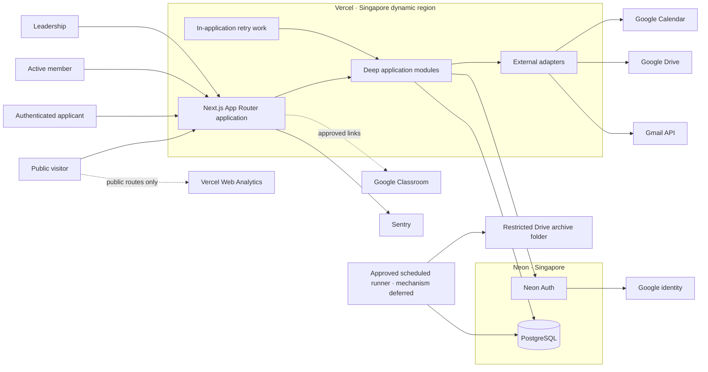
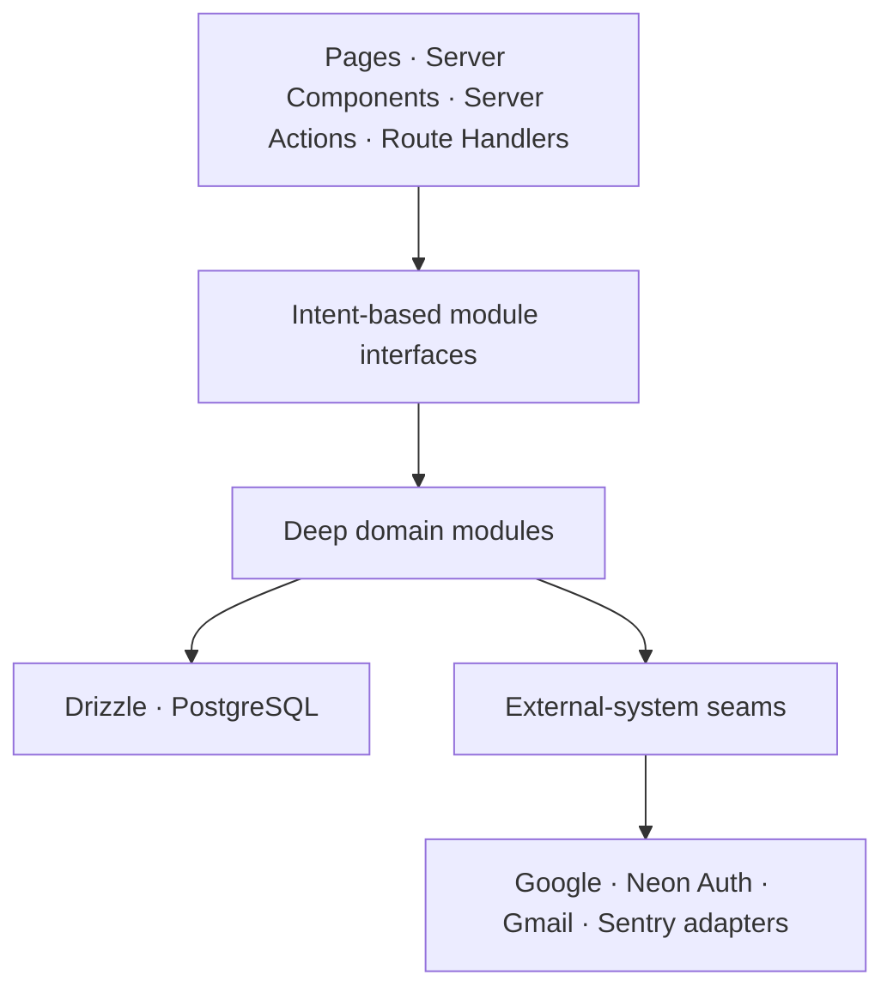
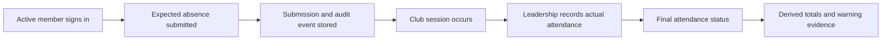
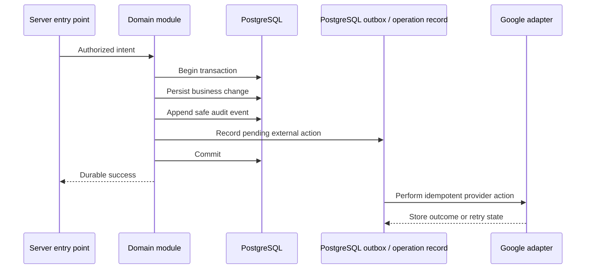

# LOGOS Web Architecture

> - Status: Foundational architecture map
> - Project: LOGOS — The Tokyo International School Math Club
> - Repository: `LOGOS-The-TIS-Math-Club/logos-web`
> - Visibility: Public (open source)
> - Last updated: 2026-08-30

## 1. Purpose and authority

This document defines the long-term technical map for the LOGOS website. It records established architecture decisions, system boundaries, sources of truth, security guarantees, and provider relationships.

It is deliberately **not** a feature specification, database schema, page inventory, implementation plan, or phase checklist. Development is divided into separately approved phases. Each phase decides the detailed behavior and acceptance criteria for a bounded part of this map.

The following rules govern future work:

- Phase specifications must conform to this architecture.
- A phase may refine a deferred decision, but it may not silently contradict an architectural invariant.
- Provider, trust-boundary, source-of-truth, region, or security-model changes require this document to be updated and, when useful, an Architecture Decision Record (ADR).
- “Deferred” means intentionally undecided. It is not permission for an implementer to choose silently.
- This document describes the intended system. It does not claim that services, credentials, integrations, or controls have already been provisioned or verified.

### Decision classes

This map contains three kinds of decisions:

- **Confirmed baseline** — a choice explicitly approved during project planning.
- **Derived safeguard** — an architecture rule selected here because it is needed to satisfy the approved security, privacy, reliability, or maintainability priorities. Examples include the modular-monolith shape, stable internal identity keys, transactional notification intents, synthetic preview data, least-privilege database roles, and archive-integrity records.
- **Deferred decision** — product policy or implementation detail that still requires explicit approval.

Confirmed choices and derived safeguards are both binding after this document is accepted. Their distinction prevents a prudent technical consequence from being misrepresented as an earlier product-policy confirmation.

## 2. Architectural drivers

The architecture is optimized in this order:

1. **Security and student privacy** — security is a release gate, not a later enhancement.
2. **Simplicity** — the club has approximately 20 members and does not need enterprise infrastructure.
3. **Reliability and auditability** — important actions must be recoverable, explainable, and traceable.
4. **Low cost** — target a free or extremely low-cost operation without assuming that free tiers are permanent.
5. **Maintainability** — prefer official framework conventions, standard PostgreSQL, and a small number of deep modules.
6. **Clear ownership** — every kind of information has one authority; caches and projections are rebuildable.
7. **Least privilege** — identities, credentials, environments, and modules receive only the access they require.
8. **Accessibility** — the product targets WCAG 2.2 AA and works across devices and input methods.

## 3. Product boundary

LOGOS Web is a comprehensive club hub with public and authenticated areas.

### Public experience

Public visitors can access approved information such as:

- About LOGOS
- Leadership profiles
- Public announcements and events
- Approved public documents and resource links
- The membership-application entry point

### Authenticated experience

Authenticated capabilities are granted by server-side authorization, not by the existence of a Google session alone.

- **Applicants** authenticate through Google and can submit after their school affiliation is established by an approved hosted domain or the approved leadership-verification process.
- **Members** can access member resources, schedule links, Google Classroom and Drive links, and the absence-submission workflow.
- **Leadership** can perform approved membership, attendance, warning, content, and audit operations.

`public`, `member`, and `leadership` describe technical access levels. Applying is a capability, not a permanent access level. Club titles such as founder, leadership-team member, supervisor, and member are separate from technical access and do not implicitly grant permissions.

### External content boundary

- Google Classroom remains the home of weekly learning materials.
- Google Drive remains the home of documents and learning files.
- Google Calendar remains the authoritative event calendar.
- The website organizes and links to those resources; it does not copy their files into PostgreSQL.
- Classroom roster synchronization and Classroom write automation are not part of the established baseline.
- Drive permission management is not part of the established baseline. Read-only Drive access may surface metadata and existing links, but cannot change sharing settings.

## 4. System context

The deployed shape is a **security-first modular monolith**: one Next.js application, one PostgreSQL database, and provider adapters at genuine external seams. There is no separate Render service, standalone API server, microservice fleet, Redis layer, or dedicated queue unless a demonstrated need justifies an architecture change.

## 5. Technology baseline

| Concern            | Architecture choice                                | Architectural rule                                                                               |
| ------------------ | -------------------------------------------------- | ------------------------------------------------------------------------------------------------ |
| Hosting            | Vercel                                             | Full-stack Next.js deployment; dynamic execution configured for Singapore                        |
| Framework          | Next.js with App Router                            | Follow official Next.js conventions and use the latest stable release selected at initialization |
| UI runtime         | React                                              | Use the latest stable release selected at initialization; React Server Components by default     |
| Language           | TypeScript                                         | Strict mode; avoid unsafe boundary casts                                                         |
| Runtime            | Node.js 24 LTS                                     | Pin the supported runtime and upgrade deliberately                                               |
| Package manager    | pnpm                                               | Pin pnpm and commit `pnpm-lock.yaml`                                                             |
| Styling            | Tailwind CSS                                       | Tailwind's official color palette is the required raw color source                               |
| UI primitives      | shadcn/ui, selectively                             | Use for complex accessible controls; it does not define LOGOS visual identity                    |
| Validation         | Zod                                                | Validate all untrusted input and provider data at trust boundaries                               |
| Client forms       | Native React first; React Hook Form when justified | Do not add form-state complexity to simple forms                                                 |
| Database           | Neon PostgreSQL                                    | Standard, portable PostgreSQL in Singapore                                                       |
| Authentication     | Neon Auth with Google OAuth                        | Authentication proves identity; application authorization grants access                          |
| Database access    | Drizzle ORM and Neon serverless driver             | Server-only access; version-controlled migrations                                                |
| Testing            | Vitest, React Testing Library, Playwright          | Test rules, interfaces, accessible UI behavior, and critical journeys                            |
| CI                 | GitHub Actions                                     | Format, lint, type-check, test, build, and smoke-test gates                                      |
| Errors             | Sentry free tier                                   | Sanitized diagnostics only; no sensitive student data                                            |
| Analytics          | Vercel Web Analytics                               | Public routes only; no protected-area or sensitive-parameter tracking                            |
| Dependency updates | Dependabot                                         | Weekly grouped pnpm/Actions updates; security alerts immediately; no automatic major merges      |
| Releases           | Release Please                                     | Conventional Commits, Semantic Versioning, changelog, tags, and GitHub releases                  |
| License            | MIT                                                | Repository source license                                                                        |

The initial product version target is `0.1.0`. Major framework or dependency upgrades are reviewed, tested changes rather than automatic drift.

## 6. Application structure

### 6.1 Dependency direction

The dependency rules are:

- Pages, components, Server Actions, and Route Handlers call module interfaces. They do not contain business policy.
- Client components never query PostgreSQL or receive database credentials.
- Modules expose intent-named operations, not a generic CRUD layer.
- A module owns its invariants, authorization checks, transaction behavior, and audit obligations.
- Cross-module work uses narrow application interfaces instead of direct access to another module's tables.
- Provider SDK types stop at adapters and do not leak into domain rules.
- Add an abstraction at a real volatility or trust seam. Do not create a repository interface for every table.
- Prefer a few deep modules that hide complexity over many shallow pass-through services.

### 6.2 Logical module map

These are architectural responsibilities, not a required folder tree.

| Module                | Owns                                                                                      | Complexity hidden behind its interface                                                 |
| --------------------- | ----------------------------------------------------------------------------------------- | -------------------------------------------------------------------------------------- |
| Identity and access   | Identity association, school-account evidence, sessions, access resolution, authorization | Neon Auth, Google claims, active-membership checks, default-deny guards                |
| Applications          | Authenticated application intake and leadership review                                    | Validation, school-domain review flags, persistence, notification request, audit event |
| Membership            | Member lifecycle and relationship to access                                               | Current/former state, club title versus access, historical changes, revocation         |
| Attendance            | Club sessions, expected absences, actual attendance, corrections, derived totals          | Matching, finalization, consistency, aggregation, audit history                        |
| Warnings              | Warning evaluation and deliberate issuance                                                | Phase-defined policy, evidence, leadership confirmation, notification request          |
| Content and resources | Public/member content metadata and approved links                                         | Visibility, publishing state, safe metadata, leadership editing                        |
| Workspace             | Calendar, Drive, and Classroom-facing access                                              | Provider calls, caching, link handling, degraded behavior                              |
| Notifications         | Application/absence confirmations and leadership alerts                                   | Gmail adapter, safe templates, retry and delivery state                                |
| Audit and security    | Business and security journals, authorized search, daily archives                         | Redaction, append-only controls, correlation, integrity manifests                      |
| Operations            | Health, backups, restoration evidence, incident support                                   | Sentry, scheduled jobs, encrypted exports, recovery checks                             |

Detailed schemas, functions, folder placement, and cross-module orchestration belong to phase specifications. Official Next.js, React, TypeScript, pnpm, and PostgreSQL naming conventions take precedence over custom project conventions. Whether the project uses a `src/` wrapper is not fixed by this document.

## 7. Sources of truth

| Information                                                       | Authority                       | Permitted secondary representation                                      |
| ----------------------------------------------------------------- | ------------------------------- | ----------------------------------------------------------------------- |
| Authenticated identity and session                                | Neon Auth with Google OAuth     | Stable internal user reference in application records                   |
| Membership applications                                           | PostgreSQL                      | Notifications and sanitized audit references                            |
| Membership                                                        | **Cutover decision required**   | See the membership-authority note below                                 |
| Sessions, expected absences, actual attendance, warnings          | PostgreSQL                      | Rebuildable totals, views, reports, and archives                        |
| Website announcements, leadership profiles, and resource metadata | PostgreSQL                      | Rendered pages and caches                                               |
| Events                                                            | Google Calendar                 | Short-lived cache and optional website-only presentation metadata       |
| Documents and learning files                                      | Google Drive                    | Safe metadata and existing links in PostgreSQL                          |
| Weekly materials                                                  | Google Classroom                | Convenient website links                                                |
| Classroom roster and Classroom membership status                  | Google Classroom                | No automatic synchronization is currently approved                      |
| Email delivery                                                    | Gmail API                       | Delivery state and provider reference; never email bodies in audit logs |
| Business and security history                                     | Append-only PostgreSQL journals | Encrypted daily archives in a restricted Drive folder                   |
| Source code and releases                                          | GitHub                          | Vercel deployments built from the repository                            |

### Membership-authority note

Before the website pivot, `logos-data-membership` was explicitly required as the complete membership list. Later website decisions established PostgreSQL as the operational store for native forms and club workflows, but the Sheet-to-database authority and cutover were never explicitly resolved.

A phase specification must therefore choose and test one of these states before membership implementation:

1. the Sheet remains authoritative and PostgreSQL is a projection;
2. PostgreSQL becomes authoritative after a controlled migration, while the Sheet becomes an export/archive; or
3. another explicitly approved transition arrangement.

The Sheet and PostgreSQL must never operate indefinitely as equal writable masters.

### Identity identifiers

School email is the primary human-facing member identifier and matching field. Internally, relational records use an immutable authentication identifier, such as the Neon Auth user ID backed by Google's OIDC subject, so an approved email change does not break history. Email ownership, school affiliation, membership, club title, and technical access remain distinct facts.

## 8. Core data relationships and flows

### 8.1 Sign-in and authorization

1. A user authenticates through Neon Auth and Google OAuth using identity-only scopes.
2. The server requires Google's verified-email evidence and a suitable hosted-domain claim for automated affiliation.
3. `tokyois.com` is pre-approved. Other domains on the approved school-domain list satisfy affiliation automatically. An unknown hosted domain remains `pending-verification` until leadership completes the approved verification process.
4. A typed email suffix alone never proves identity or school affiliation.
5. Every protected operation independently resolves current membership and technical access. Authentication alone grants neither.
6. Deactivation or access removal must take effect promptly and must be audited.

### 8.2 Membership application

1. The applicant signs in with a Google account whose email control is verified; approved hosted-domain evidence or leadership review establishes school affiliation.
2. The application interface derives identity from the authenticated session and validates the approved fields.
3. The application, audit event, and notification intent are written in the same PostgreSQL transaction.
4. Delivery begins only after that transaction commits.
5. Gmail sends the applicant confirmation and leadership alert through a delivery-state-aware notification flow.
6. Submission never creates active membership automatically.

The exact questions, application statuses, review sequence, capacity policy, and retention period are phase decisions.

### 8.3 Expected absence and actual attendance

An expected-absence submission records what is expected; it never determines what actually happened. Leadership records or corrects actual attendance separately. Leadership may submit or correct an absence on a member's behalf, and every such action is audited.

The established attendance states are:

- `unmarked`
- `present`
- `late`
- `excused-absence`
- `unexcused-absence`

Attendance totals are derived from the underlying attendance ledger. A cached total may improve display performance, but it must be rebuildable. Late thresholds, excusal review, warning points, escalation thresholds, reset rules, and consequences remain phase decisions.

### 8.4 Legacy form preservation

The existing absence Google Form and all of its historical responses are preserved. Migration to the native website form must be additive and non-destructive. The Google Form may remain available as a temporary fallback until the native workflow and data migration are tested and explicitly accepted; retirement is never assumed from implementation alone.

### 8.5 Calendar and resources

- The website reads Calendar through the Workspace adapter and caches it briefly.
- If Calendar is temporarily unavailable, the last successful result may be shown with a visible freshness timestamp.
- PostgreSQL must not become a second writable event authority.
- Drive and Classroom resources appear as approved metadata and links. The website does not copy file binaries.
- Stable public website images live in the repository and are delivered through Vercel.
- User uploads are not part of the initial architecture.

### 8.6 Durable mutation, audit, and external side effects

A database mutation, its required audit event, and any resulting external-action intent succeed or fail in one PostgreSQL transaction. Provider delivery begins after commit. Google and email effects use the durable outbox/operation record, bounded retries, and idempotency where the provider supports it. An ambiguous provider outcome is recorded for reconciliation rather than blindly retried.

## 9. Identity, credentials, and authorization

### 9.1 Credential separation

| Identity or credential                                   | Purpose                                       | Maximum intended access                                                                                                                                         |
| -------------------------------------------------------- | --------------------------------------------- | --------------------------------------------------------------------------------------------------------------------------------------------------------------- |
| Individual Google account through Neon Auth              | User sign-in                                  | `openid`, `email`, and `profile` identity scopes only                                                                                                           |
| Dedicated Workspace resource service account             | Calendar and surfaced Drive resources         | Calendar read/write; Drive read-only; exact resources explicitly shared to it                                                                                   |
| Revocable OAuth token for `mathclub@tokyois.com`         | Transactional club email                      | Gmail `gmail.send` only                                                                                                                                         |
| Required archive write path; identity/mechanism deferred | Encrypted audit archives and database backups | Folder-scoped creation, read-back verification, and retention deletion only; no access to unrelated Drive resources; exact enforceable grants are phase-defined |

These identities are independently revocable and remain server-only. OAuth tokens never enter browser storage. Domain-wide delegation is prohibited by the established architecture.

The normal Drive adapter remains read-only. It must not be silently broadened to solve archive uploads. Before archive implementation, a phase must approve and test a separate narrowly scoped writer, its rotation procedure, and its incident-revocation procedure. That credential is available only to the approved archive/backup runner, never the web runtime or preview deployments.

Development and preview credentials must not access production Workspace resources. If the school blocks service accounts or required scopes, the integration is blocked pending an explicitly approved alternative; no fallback credential is assumed.

### 9.2 Authorization model

- Protected operations are default-deny.
- Server-side code verifies identity, active membership, and the required capability on every operation.
- UI visibility is not an authorization control.
- Club titles and technical capabilities are modeled separately.
- Access elevation, revocation, and permission changes are audited.
- Protected data is never statically generated into public output, placed in URLs, or cached publicly.
- Session cookies are `Secure`, `HttpOnly`, and appropriately `SameSite`.
- The final capability matrix within leadership, leadership bootstrap process, session lifetime, forced revocation behavior, and any 2-Step Verification requirement remain phase decisions.

## 10. Security and privacy architecture

### 10.1 Data classification

| Class             | Examples                                                        | Handling rule                                                                                            |
| ----------------- | --------------------------------------------------------------- | -------------------------------------------------------------------------------------------------------- |
| Public            | Published About content, approved public events and links       | May be cached and analyzed on public routes                                                              |
| Internal          | Non-sensitive club operations and configuration                 | Authenticated access; least-privilege visibility                                                         |
| Student-sensitive | Applications, membership, attendance, warnings, absence details | Server-mediated, authorization-scoped disclosure; never public, publicly cached, or emitted to telemetry |
| Secret            | Infrastructure credentials, OAuth tokens, encryption keys       | Secret stores only; never application data, source code, logs, or client output                          |

Only information needed for club operations is collected. Absence workflows should prefer structured categories over unnecessary medical or personal free text. Any sensitive free-text field requires an explicit purpose, access rule, encryption decision, and shorter retention decision before implementation.

Provider-managed authentication and session artifacts may reside in Neon Auth's protected schema. This does not permit infrastructure credentials or archive-encryption keys to be stored as application data.

### 10.2 Required controls

- Secure response headers and a restrictive Content Security Policy
- Zod validation at every untrusted boundary
- Server-side authorization independent of client behavior
- CSRF protection appropriate to each mutation mechanism
- Secure session cookies and no client-side token persistence
- Rate limiting on authentication-adjacent, form, and sensitive mutation interfaces; the selected control must work across Vercel instances rather than rely on process-local memory
- TLS for every database and provider connection
- Parameterized Drizzle queries, database constraints, and transactions
- Separate runtime, migration, backup, and audit database roles with least privilege
- Version-controlled migrations; no direct production schema push
- Dependency, secret, and vulnerable-package scanning
- Environment isolation and independently scoped secrets
- Explicit timeouts and bounded retries for external calls
- Incident procedures for revocation, access suspension, restore, and integrity verification

The runtime database role receives only required data permissions. The migration role receives DDL access only during controlled deployment. The backup role is read-only. Normal application access to audit journals is append/select only and cannot update, delete, truncate, or cascade-delete past events.

### 10.3 Environment isolation

Development, preview, test, and production use separate data and credentials.

Neon preview branches must be created from an empty or schema-only baseline and populated with synthetic fixtures. A preview must never inherit, clone, or access production student records. Preview OAuth, Gmail, Calendar, and Drive credentials must be restricted to non-production resources or replaced with safe adapters.

Secrets live in Vercel/GitHub secret stores or an ignored local `.env.local`; they never enter Git. Repository code must not expose a client-usable database URL.

### 10.4 Observability privacy

Sentry receives sanitized errors and performance diagnostics only. Scrubbing must remove request bodies, headers, cookies, query parameters, names, email addresses, absence reasons, form responses, and tokens. Session replay is disabled on authenticated areas.

Vercel Web Analytics runs only on public routes and never receives sensitive URL parameters. Raw IP or device retention is not assumed and requires a specific privacy purpose and retention decision.

Because students may be minors, the privacy notice, cross-border processing disclosure, correction/deletion process, and retention policy require policy review before launch. This records a security/privacy launch requirement; it does not move school approval into this architecture's scope.

## 11. Audit, logs, and daily archives

Auditability is a core subsystem, not a collection of application `console.log` calls.

### 11.1 Separate record types

| Record                | Purpose                                                                    | Examples                                                                                                    |
| --------------------- | -------------------------------------------------------------------------- | ----------------------------------------------------------------------------------------------------------- |
| Business audit event  | Explain important domain changes                                           | Application review, member state change, attendance correction, warning issuance, content publication       |
| Security event        | Explain security-relevant activity                                         | Sign-in result, denied authorization, access elevation, suspicious activity, credential/integration failure |
| Operational telemetry | Diagnose software health                                                   | Sanitized exception, latency, provider outage, job failure                                                  |
| Daily audit archive   | Preserve a second encrypted, integrity-checked copy of a completed JST day | Ordered events, daily summary, manifest, checksums                                                          |
| Database backup       | Restore the system after loss or corruption                                | Encrypted logical backup of required application/authentication data                                        |

These records have different purposes. Daily summaries never replace raw events, and database backups are not treated as an audit trail.

### 11.2 Event guarantees

An audit or security event includes, where applicable:

- Immutable event ID
- Database-generated UTC timestamp
- Derived `Asia/Tokyo` archive date
- Schema version
- Internal actor ID and actor type
- Relevant access/club-role snapshot without sensitive profile data
- Source and correlation/request ID
- Category and intent-named action
- Target type and internal target ID
- Result and reason code
- Explicitly allowlisted, sanitized before/after summary
- Minimal safe metadata

Events never copy full database rows, names, emails, absence reasons, form answers, cookies, tokens, request bodies, or email bodies. Corrections append compensating events; history is never edited. Viewing or exporting protected logs is itself audited.

Important business mutations and their audit inserts occur in one transaction. If the audit insert fails, the mutation fails. External-provider outcomes are connected through durable operation records and correlation IDs.

“Append-only” means normal application credentials cannot change past events. A privileged database administrator can technically alter PostgreSQL; therefore the architecture adds integrity-linked daily manifests but does not claim tamper evidence or true write-once storage without an independent trust anchor.

### 11.3 Leadership log interface

The authenticated leadership interface must make logs understandable and searchable without exposing sensitive payloads. It supports filters by:

- JST date or date range
- Internal person/reference ID
- Category and action
- Target type/reference
- Result or outcome
- Correlation/reference ID

The exact leadership capabilities and whether members may view their own history remain phase decisions.

### 11.4 Daily archive model

After a JST calendar day has fully closed, an idempotent job produces that day's archive package. It does not depend on exact midnight execution.

Each archive contains:

- Ordered audit/security events for the completed day
- A derived daily summary and rebuildable aggregates
- Event range and row counts
- Archive/export schema version
- Creation timestamp
- Content checksum
- Previous-manifest checksum for an integrity-linked chain

The idempotency key includes the archive date, archive type, and schema version. The archive is encrypted before upload; plaintext archives are never stored or logged. The job prevents duplicate concurrent execution, verifies upload integrity, records its outcome, and retries safely. Repeated failure alerts through at least one channel independent of Google, such as Sentry or GitHub Actions notifications.

The encryption key is stored separately from Drive. Key custody, rotation, emergency access, archive format, scheduler/runner, and audit/archive retention are deferred decisions that must be settled and restoration-tested before this subsystem is considered complete.

## 12. Backup and recovery

The established backup baseline is:

- One encrypted logical PostgreSQL backup each day
- Thirty days of daily backup retention
- An additional backup before every production migration
- Storage in a restricted Drive backup location
- Checksum verification after upload
- Quarterly restoration into an isolated database, with results recorded

The backup must include all application and authentication schemas required to restore a usable system. That coverage must be proven through restoration rather than assumed.

A production migration cannot begin until its pre-migration backup has completed, uploaded successfully, and passed checksum verification.

Backup and archive jobs may use a suitable scheduled runner, but the runner is not yet fixed. Vercel's low-cost daily scheduling is not treated as precise; a tightly scoped GitHub Actions workflow or another approved mechanism may be more suitable for logical backups. Recovery Point Objective, Recovery Time Objective, encryption-key custody, and the detailed incident runbook remain deferred.

## 13. Google Workspace architecture

### Calendar

- Calendar is authoritative.
- The resource adapter has read/write access only to explicitly shared club calendars.
- The website briefly caches event data.
- Cached data shown during failure includes a visible freshness timestamp.
- Whether leadership may edit Calendar through the website is a phase decision; read/write scope alone does not approve a UI capability.

### Drive

- Drive is authoritative for club documents and learning files.
- The normal resource adapter is read-only and limited to explicitly shared resources.
- PostgreSQL stores safe metadata and existing links, not file binaries.
- The website does not change sharing permissions.
- The approved archive write path is isolated from the normal Drive adapter, available only to the archive/backup runner, and limited to a restricted archive/backup folder.

### Classroom

- Classroom remains the weekly-material source.
- The initial website architecture supports convenient links.
- Classroom API write access, roster synchronization, and automated membership status updates are not approved.

### Gmail

- `mathclub@tokyois.com` sends application alerts, absence alerts, and submission confirmations through the Gmail API.
- The token uses only `gmail.send` and is independently revocable.
- Warning emails require a deliberate leadership action.
- A Gmail outage never loses an application or absence submission. Failures known to occur before provider acceptance may retry; an ambiguous result is recorded as `delivery-unknown` and is not blindly resent. Reconciliation or manual retry behavior is phase-defined.

Google Workspace administrator policy, OAuth consent configuration, service-account sharing, required claims, and actual API access must be verified before a dependent phase is considered complete.

## 14. Frontend and design foundation

### Tailwind color architecture

The **Tailwind CSS color palette is mandatory**. It is the raw color vocabulary for the LOGOS interface.

- Semantic tokens such as `background`, `foreground`, `surface`, `primary`, `secondary`, `muted`, `border`, `focus`, `success`, `warning`, `danger`, and `info` map to values from Tailwind's official palette.
- Components consume semantic tokens rather than choosing unrelated palette values locally.
- shadcn/ui variables must be mapped into the same Tailwind-based token system.
- Application components default to the official Tailwind palette. Any non-palette application color must be deliberate, documented, and accessible rather than introduced ad hoc.
- A documented exception may be made for an externally controlled brand asset or a visualization that the Tailwind palette cannot express accessibly.
- Exact LOGOS hues, neutral family, semantic mappings, typography, imagery, and whether to ship a dark theme remain later design decisions.

Color never serves as the only indicator of status. Every selected token combination must meet the applicable WCAG 2.2 AA contrast requirement.

### Interaction and accessibility

- Responsive behavior is required from the beginning.
- All workflows operate by keyboard and expose visible focus.
- Controls use semantic HTML and accessible names.
- shadcn/ui is used selectively for difficult interactive primitives, not as a prebuilt visual identity.
- English is the initial interface language, while text handling remains Unicode-safe and localization-ready.
- Timestamps are stored in UTC and displayed and grouped in `Asia/Tokyo`.

## 15. Next.js implementation conventions

- App Router is mandatory.
- React Server Components are the default; client components are introduced only for browser interaction or client state.
- Server Actions handle internal authenticated mutations when appropriate.
- Route Handlers handle OAuth callbacks, webhooks, and true external HTTP interfaces.
- Every Server Action and Route Handler validates input and authorizes independently.
- Zod schemas protect trust boundaries, including third-party responses.
- React Hook Form is reserved for forms whose client-side interaction justifies it.
- ESLint uses the official Next.js rules; Prettier controls formatting; TypeScript runs in strict mode.
- The conventional `@/*` import alias is used.
- Folder, file, component, route, database, and test names follow the conventions of their framework or language.
- No local Git hooks are required initially; CI is authoritative.

## 16. Reliability and degraded behavior

| Failure                                 | Required behavior                                                                                                                                              |
| --------------------------------------- | -------------------------------------------------------------------------------------------------------------------------------------------------------------- |
| PostgreSQL unavailable                  | Do not report success; preserve idempotency so retry cannot duplicate a submission                                                                             |
| Authentication provider unavailable     | Public pages remain usable; protected access fails closed                                                                                                      |
| Authorization cannot be verified        | Deny the protected operation                                                                                                                                   |
| Calendar unavailable                    | Show last successful cache only with its freshness timestamp; otherwise show a clear unavailable state                                                         |
| Gmail unavailable                       | Keep the durable submission; retry only a known pre-acceptance failure, and record an ambiguous outcome as `delivery-unknown` for reconciliation/manual action |
| Google write times out                  | Reconcile by provider operation/reference ID where available; never blindly retry an ambiguous non-idempotent action                                           |
| Drive or Classroom resource unavailable | Preserve the page and identify the unavailable external resource without exposing provider details                                                             |
| Archive or backup fails                 | Retain job state, retry safely, alert leadership, and never delete the live source records                                                                     |
| Sentry or analytics unavailable         | Core workflows continue normally                                                                                                                               |

External calls use timeouts, bounded exponential backoff, and idempotency where supported. Ambiguous mutations enter a reconciliation state. The application never presents an external action as complete until its confirmed state supports that claim.

## 17. Deployment, environments, and regions

### Environment model

- **Development** uses local or isolated development data and safe adapters/credentials.
- **Preview** is created for pull requests, uses a schema-only Neon branch with synthetic data, and cannot reach production student or Workspace data.
- **Production** uses production Neon, Auth, and explicitly scoped Workspace credentials after the Phase 11 launch gate.
- Every Preview deployment remains protected by Vercel Authentication for the life of the project.
- Vercel Hobby Standard Protection does not protect a Production domain. Through Phase 10, the project therefore creates only access-protected Preview deployments, including for `main`, and publishes no Vercel Production deployment. The existing `tislogos.org` registration may remain attached to the project without authorizing live Production delivery.
- Phase 11 alone may map `main` to Vercel Production and expose the retained production domain after the launch gate passes. Authenticated application routes remain `noindex` after launch.
- Any deployment-protection bypass credential is CI-only, narrowly scoped, independently revocable, unavailable to untrusted pull requests, and excluded from URLs and recorded evidence.

### Region model

- Vercel dynamic functions are explicitly configured and verified to run in Singapore (`sin1`).
- The primary Neon PostgreSQL project must be created in AWS Asia Pacific (Singapore).
- Static assets are served near visitors through Vercel's CDN.
- Co-locating dynamic execution and PostgreSQL reduces database round-trip latency.
- The primary Neon project is configured in Singapore, not Japan; this cross-border choice was accepted.
- This does **not** mean all LOGOS data is confined to Singapore. Google Workspace, GitHub, Vercel CDN/logging, Sentry, and their subprocessors may process data in other locations.

Vercel defaults must not be assumed: the Singapore function region is configured and checked after deployment.

## 18. Testing and release gates

### Test layers

- **Vitest** tests business rules and module interfaces.
- **React Testing Library** tests accessible component behavior.
- **Playwright** tests critical browser journeys such as sign-in, application, absence, attendance authorization, and leadership workflows.
- External Google adapters use controlled fakes/mocks in automated tests and scoped integration tests where safe.
- PostgreSQL behavior, constraints, migrations, and transaction/audit guarantees are tested against an isolated compatible database.

Testing is risk-based; there is no arbitrary global coverage percentage. Authorization, redaction, attendance finalization, warning-policy evaluation, audit append-only permissions, compensating-event behavior, archive integrity, idempotency, migrations, and recovery paths receive deeper coverage because their failure cost is higher.

### CI gates

Every pull request must pass, as applicable:

1. formatting check;
2. ESLint;
3. strict TypeScript check;
4. automated tests;
5. production build;
6. critical smoke tests;
7. dependency and secret/security checks.

A known security failure blocks release.

Before production deployment, `main` is protected: required CI checks cannot be bypassed by an ordinary direct push, and force pushes are blocked. Routine administrator bypass is prohibited. The required reviewer count, eligible break-glass actors, and exact emergency mechanism remain deferred.

## 19. Git, delivery, and versioning

- `main` is the protected integration branch and becomes the Vercel Production branch only at the Phase 11 launch gate.
- Work occurs on short-lived feature/fix branches.
- Pull requests receive Vercel previews and isolated Neon preview data.
- Approved phase pull requests preserve their curated Conventional Commits through protected rebase-and-merge.
- There is no permanent `develop` branch.
- Through Phase 10, merging to `main` creates an access-protected Vercel Preview rather than a Production deployment.
- The public open-source repository and protected `main` branch prevent ordinary direct or force pushes from bypassing the required delivery gates.
- Commit messages use the agreed simplified Conventional Commits convention.
- Release Please derives changelogs, SemVer tags, and GitHub releases.
- Dependabot groups routine pnpm and GitHub Actions updates weekly, while security updates surface immediately.
- Major dependency updates require manual review and testing; they are not auto-merged.
- The categorized `.gitignore` excludes secrets and environment files, framework/build output, database dumps and backups, test/tool caches, editor files, and operating-system artifacts.

Production releases document meaningful milestones even though deployment may occur more frequently than a tagged release.

## 20. Cost, scale, and portability

The system is designed for approximately 20 members and low request volume. Vercel and Neon free tiers are the operating target, not an uptime, quota, price, or long-term availability guarantee. Vercel Hobby eligibility for this school-club use must be verified before launch.

The repository is public under the MIT license and uses GitHub Free. Public visibility was approved after a tracked-file, history, metadata, ignored-file, and secret-exposure review. `main` remains protected with required pull requests and checks, force-push and deletion protection, and no routine administrator bypass. No paid GitHub plan or add-on is permitted.

Vercel Hobby is the only approved hosting plan. Because Hobby cannot protect a Production domain with Vercel Authentication at no cost, no Vercel Production deployment is published before Phase 11. Retaining the existing domain registration does not change this boundary. This is an explicit zero-cost architecture decision, not a claim that Hobby provides paid All Deployments protection.

The application avoids infrastructure that this scale does not justify. A second backend, microservices, Redis, a dedicated queue, a data warehouse, or enterprise administration requires evidence and an architecture review.

Portability is protected by:

- standard PostgreSQL rather than proprietary data modeling;
- version-controlled Drizzle migrations;
- provider logic isolated in adapters;
- database backups and tested restoration;
- business policy kept out of provider SDK calls;
- stable module interfaces that can outlive a hosting vendor.

## 21. Phase governance

The active development order and broad completion gates are defined in [roadmap.md](./roadmap.md). Detailed phase plans use the `phase-##.md` naming convention and may add implementation detail without weakening this architecture.

Each implementation phase should define only the detail needed for its bounded outcome, including:

- objective and non-goals;
- relevant architecture sections;
- approved behavior and policy decisions;
- interfaces and data changes;
- authorization and privacy rules;
- migration/cutover plan when applicable;
- failure behavior;
- tests and acceptance criteria;
- documentation and operational handoff.

A phase is not complete merely because its UI exists. Its data integrity, authorization, audit events, failure paths, migration, and tests must also satisfy this architecture.

## 22. Explicitly deferred decisions

The following remain intentionally undecided and belong to future approved phases or architecture amendments:

- Detailed delivery dates and calendar schedule
- Final sitemap, navigation, and detailed page content
- Exact database tables, columns, indexes, constraints, and identifiers
- Whether `logos-data-membership` remains authoritative or transitions to PostgreSQL, and the cutover procedure
- Membership-state vocabulary and former-member retention
- Application questions, statuses, review flow, capacity enforcement, and rejection retention
- Complete approved-school-domain list and the manual affiliation-verification procedure
- Club-title vocabulary and the detailed founder/leadership/supervisor capability matrix
- Leadership bootstrap, session lifetime, revocation mechanics, and any 2-Step Verification requirement
- Attendance correction rules, late threshold, and excusal review process
- Warning point weights, thresholds, escalation levels, reset rules, consequences, and wording
- Whether members can see their own attendance, warning, or audit history
- Exact public-document publishing policy
- Whether leadership may edit Calendar events through the website
- Classroom API automation and roster synchronization
- Existing Google Form, Sheet, and historical-response migration and retirement criteria; preservation and non-destructive migration are not deferred
- General retention/deletion periods for applications, former members, attendance, warnings, audit/security events, and daily archives
- Sensitive absence-data categories and any free-text handling
- Archive format, archive/backup runner, encryption-key custody, key rotation, and archive retention
- Recovery Point and Recovery Time Objectives and the complete incident runbook
- Rate-limit implementation/provider and exact thresholds
- Exact LOGOS Tailwind colors, semantic token values, typography, imagery, and dark-theme decision
- Custom domain and DNS
- Required reviewer count, eligible break-glass actors, and exact emergency branch-protection mechanism; the prohibition on routine bypass is not deferred
- Google Workspace administrator feasibility and Vercel Hobby eligibility

## 23. Architecture change triggers

An architecture review and document update are required before:

- changing Next.js, Vercel, Neon PostgreSQL, Neon Auth, the runtime, or the selected regions;
- introducing another deployable backend or stateful infrastructure service;
- changing a source of truth or allowing two writable authorities;
- changing the identity, access-level, or credential-separation model;
- adding Google scopes, domain-wide delegation, Drive write access, or Classroom write access;
- allowing production data into a non-production environment;
- bypassing a module interface with direct cross-module table access;
- weakening audit, archive, backup, testing, accessibility, or security guarantees;
- collecting a new category of sensitive student information;
- adding public tracking to authenticated areas;
- replacing the Tailwind palette as the primary color foundation.

## 24. Official platform references

- [Next.js App Router](https://nextjs.org/docs/app)
- [Tailwind CSS colors](https://tailwindcss.com/docs/colors)
- [Tailwind CSS theme variables](https://tailwindcss.com/docs/theme)
- [Vercel function regions](https://vercel.com/docs/functions/configuring-functions/region)
- [Vercel Git deployments](https://vercel.com/docs/git)
- [Vercel Authentication](https://vercel.com/docs/deployment-protection/methods-to-protect-deployments/vercel-authentication)
- [Neon regional status](https://neon.com/docs/introduction/status)
- [Neon branching](https://neon.com/docs/guides/branching-intro)
- [Google OpenID Connect claims](https://developers.google.com/identity/openid-connect/reference)
- [Google Drive API scopes](https://developers.google.com/workspace/drive/api/guides/api-specific-auth)
- [GitHub protected branches](https://docs.github.com/en/repositories/configuring-branches-and-merges-in-your-repository/managing-protected-branches/managing-a-branch-protection-rule)
