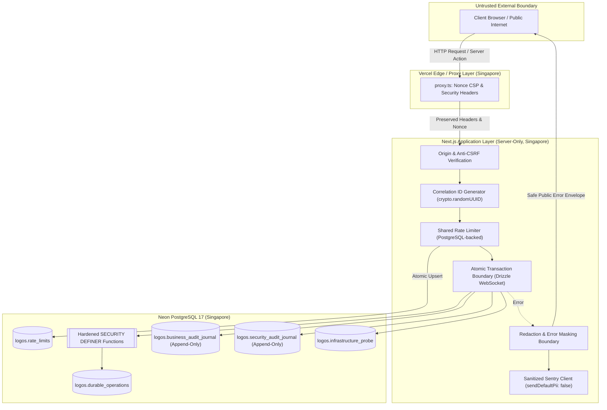
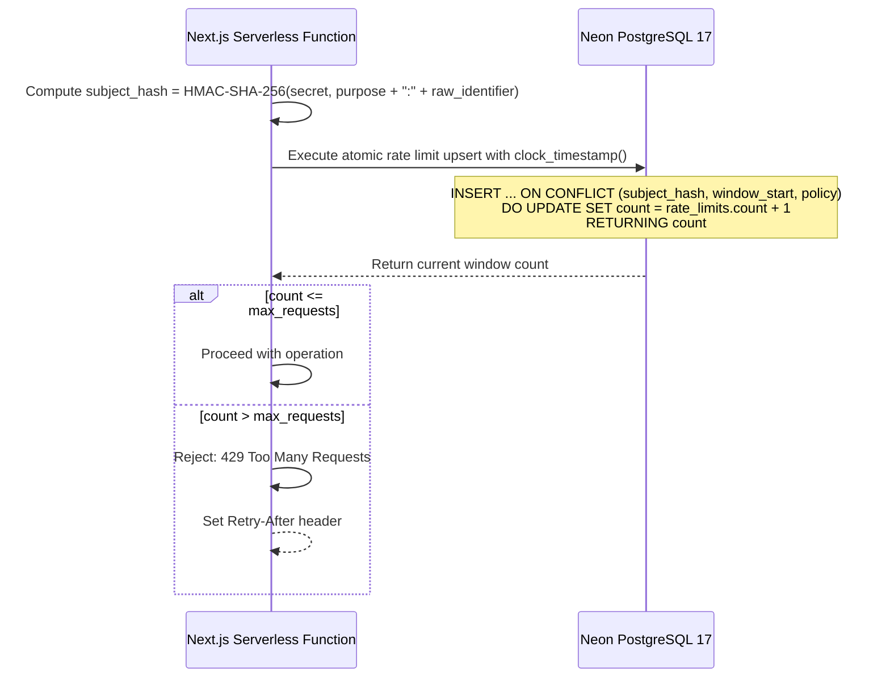
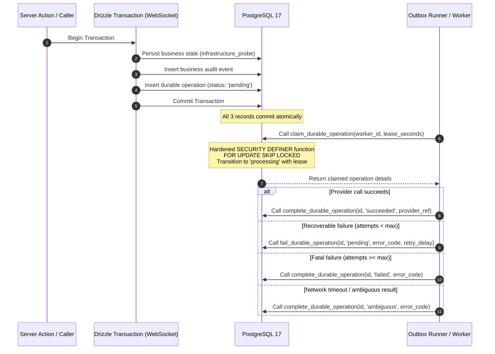

# Phase 03 — Security, Audit, and Reliable-Mutation Foundation

> - Status: In progress
> - Branch: `feat/phase-03-security-foundation`
> - Roadmap: [roadmap.md](./roadmap.md)
> - Architecture: [architecture.md](./architecture.md)
> - Predecessor: [phase-02.md](./phase-02.md) (Completed)
> - Successor: `phase-04.md`
> - Last updated: 2026-08-31

## 1. Objective

Establish foundational, shared security and durability primitives that every later protected workflow in LOGOS Web must use. This phase delivers:

1. strict origin verification against exact explicitly enumerated trusted origins only (no `*.vercel.app` suffix trust; no Host/forwarded derivation) and viable signed double-submit anti-CSRF protections for unsafe browser methods;
2. server-generated UUID correlation IDs for request and transaction tracing;
3. a PostgreSQL-backed fixed-window atomic shared rate limiter using the database clock and HMAC-SHA-256 purpose-specific subjects (no raw IP storage);
4. append-only business and security audit journals with database timestamptz, generated Tokyo archive dates, schema versioning, structured actor/action fields, DB JSON byte/shape constraints plus application allowlists, compensating corrections, non-cascade foreign keys, and explicit acknowledgment that migration ownership precludes absolute tamper-proofing;
5. hardened runtime database role boundaries denying raw `SELECT`, `UPDATE`, `DELETE`, and `TRUNCATE` to `logos_runtime` and `logos_audit` (both `INSERT`-only where required), denying `ALTER` by table ownership, retaining raw `SELECT` for `logos_backup`, and providing a bounded hardened query function for later authorized search;
6. durable operation records (outbox/operations) with correlation UUID, originating non-cascade audit FK, `available_at`, `max_attempts`, lease tracking, bounded fields, and concurrency-safe claims and fenced status transitions via hardened `SECURITY DEFINER` PostgreSQL functions;
7. an internal server-only synthetic technical mutation verifying atomic commit of data, audit, and operation intent in one Drizzle transaction, where duplicate outbox inserts create no duplicate effects;
8. deny-by-default allowlist construction before regex pattern defense-in-depth and stable public error envelopes;
9. sanitized, optional `@sentry/nextjs` telemetry configuration operating strictly within verified Developer free allowances at setup, with no billing, disabled session replay, and tracing off by default; and
10. preservation of dynamic Content Security Policy nonces and baseline HTTP response headers without asserting internal nonce implementation details.

Phase 03 establishes infrastructure, shared libraries, and security invariants only. All verification uses deterministic synthetic records; no domain tables or real student data exist.

## 2. Scope

Phase 03 owns:

- **Origin and CSRF Defense**: Server-side request-origin verification against exact explicitly enumerated trusted origins only (rejecting `*.vercel.app` suffix trust and Host/forwarded header derivation), combined with a viable signed double-submit anti-CSRF token (random token + HMAC), Secure `__Host-` `SameSite=Strict` cookie client-readable only for header echo, constant-time checks, no logging, and Phase 04 session binding deferred.
- **Correlation Engine**: Cryptographically random server-generated UUIDv4 correlation tracking bound to request context, returned in response headers, and persisted in logs, journals, and errors.
- **Shared Rate Limiter**: Cross-instance atomic rate limiter in PostgreSQL 17 using `clock_timestamp()`, HMAC-SHA-256 subject hashing with purpose salts, typed policies with documented presets (including a generic `form_submission` future preset), and an active synthetic test policy.
- **Audit Journals**: PostgreSQL schemas, tables, and constraints for `logos.business_audit_journal` and `logos.security_audit_journal` with generated `Asia/Tokyo` date extraction, DB JSON byte/shape constraints plus application allowlists, and append-only enforcement.
- **Role Boundary Hardening**: DDL and grant configurations ensuring raw journal `SELECT`, `UPDATE`, `DELETE`, and `TRUNCATE` are denied to `logos_runtime` and `logos_audit` (both `INSERT`-only where required), `ALTER` is denied by ownership, `logos_backup` retains raw `SELECT`, and migration owner realities are documented.
- **Bounded Audit Query Boundary**: Server-side bounded hardened query interface with mandatory limits, date ranges, and pagination for future authorized log search.
- **Durable Operations**: Table `logos.durable_operations` (with correlation UUID, originating non-cascade audit FK, `available_at`, `max_attempts`, lease fields, bounded provider ref/failure code/payload, DB timestamps, and state/length checks) and hardened PostgreSQL `SECURITY DEFINER` functions with fixed `search_path = pg_catalog, logos, pg_temp`, fully qualified objects, and revoked `PUBLIC` execute grants for fenced state transitions (`pending` -> `processing` -> `succeeded` | `failed` | `ambiguous`), with runtime having needed `INSERT`/`SELECT` but no `UPDATE`/`DELETE`/`TRUNCATE`.
- **Atomic Unit of Work**: Server-only composite mutation helper proving that domain data updates, audit log insertion, and durable operation intents commit or roll back together in one interactive Drizzle transaction, and duplicate outbox inserts create no effects.
- **Redaction and Error Masking**: Redaction engine enforcing allowlist construction before regex pattern defense-in-depth, producing safe public error envelopes with correlation references.
- **Telemetry Configuration**: Sentry SDK integration active only when environment variables exist, with verified Developer free allowances at setup, no billing, disabled session replay, tracing off by default, strict client/server data scrubbing, non-fatal ingestion failures, and secure source-map token handling.
- **Header Preservation**: Nonce-based dynamic Content Security Policy without asserting nonce generation implementation details, frame options, referrer policy, permissions policy, and robots directives in `proxy.ts`.
- **CI and Preview Verification**: PostgreSQL 17 automated tests in GitHub Actions, schema-only Neon preview branch isolation, and deployment verification.

## 3. Explicit Exclusions

Phase 03 does not implement:

- domain tables or business models (applications, members, sessions, absences, attendance, warnings, content, resources);
- real student, teacher, or club records;
- public HTTP endpoints, API routes, or browser form UI for technical mutations (the composite mutation helper is strictly server-only and tested via automated harnesses);
- user authentication, Google OAuth flows, session cookies, or domain affiliation verification (deferred to Phase 04);
- Google Workspace integration adapters for Calendar, Drive, Classroom, or Gmail API (deferred to Phase 05);
- daily audit archive runner execution, Drive backup upload, or encryption-key distribution (deferred to Phase 10);
- retention-based deletion or automated truncation of audit journals or operation records during Phase 03 (retention rules and archive cutoffs are evaluated in Phase 10);
- production deployment or mapping of `tislogos.org` (dormant until Phase 11).

## 4. Established Constraints

- **Hosting & Services**: GitHub Free, Vercel Hobby, Neon Free, and Sentry Developer Free tier are the only hosted services.
- **Zero Cost**: No billing, payment card, paid tier, or paid capacity may be enabled on any provider account. Free-tier allowances must be re-verified during provider setup.
- **Toolchain Pins**: Node.js `24.20.0`, pnpm `11.24.0`, Next.js `16.3.3`, React `19.2.8`, TypeScript `5.9.3`, and Tailwind CSS `4.3.3` remain strictly pinned.
- **Region Boundary**: Dynamic Vercel execution is configured for Singapore (`sin1`). PostgreSQL 17 is hosted in AWS Asia Pacific (Singapore) (`aws-ap-southeast-1`).
- **Database Architecture**: Root App Router modular monolith using server-only Drizzle ORM and `@neondatabase/serverless` WebSocket pool transactions. Connection pools are created and closed within each single request/operation.
- **Environment Isolation**: `APP_ENV` must match the owner-controlled database comment `logos.app_environment`. Synthetic fixtures and test mutations refuse `APP_ENV=production`.
- **Dormant Production**: Production remains dormant on branch `production-disabled-until-phase-11`, empty of data, and disconnected from CI, previews, and pull requests.
- **Preview Isolation**: Preview deployments use Vercel Authentication Standard Protection (`noindex, nofollow`), connect to schema-only Neon branches descending from empty non-production roots, and expire automatically.

## 5. Official References

The design in this document aligns with the following official platform and security specifications:

- [Next.js Data Security](https://nextjs.org/docs/app/guides/data-security)
- [Next.js Server Actions Configuration](https://nextjs.org/docs/app/api-reference/config/next-config-js/serverActions)
- [OWASP Cross-Site Request Forgery Prevention Cheat Sheet](https://cheatsheetseries.owasp.org/cheatsheets/Cross-Site_Request_Forgery_Prevention_Cheat_Sheet.html)
- [Sentry Next.js SDK Documentation](https://docs.sentry.io/platforms/javascript/guides/nextjs/)
- [Sentry Pricing and Free Developer Limits](https://sentry.io/pricing/)
- [PostgreSQL 17 Privileges](https://www.postgresql.org/docs/17/ddl-priv.html)
- [PostgreSQL 17 CREATE FUNCTION and SECURITY DEFINER](https://www.postgresql.org/docs/17/sql-createfunction.html)
- [PostgreSQL 17 Explicit Locking](https://www.postgresql.org/docs/17/explicit-locking.html)
- [PostgreSQL 17 Date/Time Functions and AT TIME ZONE](https://www.postgresql.org/docs/17/functions-datetime.html)
- [Drizzle ORM Transactions](https://orm.drizzle.team/docs/transactions)
- [Vercel Deployment Environments](https://vercel.com/docs/deployments/environments)
- [Vercel Deployment Protection](https://vercel.com/docs/security/deployment-protection)
- [Vercel Configuring Function Regions](https://vercel.com/docs/functions/configuring-functions/region)

## 6. Threat Model and Trust Boundaries

### 6.1 Trust Boundaries



### 6.2 Threat Vectors and Mitigations

| Threat Vector                                   | Potential Impact                                                                           | Phase 03 Mitigation                                                                                                                                                                                                                                                                     |
| ----------------------------------------------- | ------------------------------------------------------------------------------------------ | --------------------------------------------------------------------------------------------------------------------------------------------------------------------------------------------------------------------------------------------------------------------------------------- |
| **Cross-Site Request Forgery (CSRF)**           | Unauthorized execution of mutations via victim's authenticated browser session.            | Fail closed on missing, malformed, or mismatching `Origin`/`Referer` against configured allowed origin; require valid cryptographically signed/double-submit anti-CSRF tokens for unsafe browser methods; enforce that safe HTTP methods (`GET`, `HEAD`, `OPTIONS`) never mutate state. |
| **Host Header / Origin Spoofing**               | Bypass of origin checks via attacker-manipulated HTTP headers.                             | Never trust `Host`, `X-Forwarded-Host`, `X-Forwarded-Proto`, or client headers for canonical origin verification; match strictly against explicit server-configured origins (`APP_URL` and verified deployment hostnames).                                                              |
| **Distributed Brute Force & Denial of Service** | Resource exhaustion and credential guessing across transient serverless instances.         | Shared PostgreSQL-backed atomic rate limiter using database clock (`clock_timestamp()`) and HMAC-SHA-256 purpose-specific hashes; immediate `429 Too Many Requests` with `Retry-After`.                                                                                                 |
| **Student PII / IP Leakage in Logs**            | Breach of minor student privacy and compliance violation.                                  | Raw IP addresses are NEVER stored; rate limiting uses HMAC-SHA-256 hashes with purpose salts; audit payloads use strict allowlists and field sanitization; Sentry disables PII, headers, cookies, and replays.                                                                          |
| **Audit Journal Tampering**                     | Malicious actor or compromised runtime role alters or deletes historical audit events.     | Table privileges for `logos_runtime` exclude `UPDATE`, `DELETE`, `TRUNCATE`, and `ALTER`; append-only direct `INSERT` only; foreign keys forbid `ON DELETE CASCADE`; errors append compensating events.                                                                                 |
| **Outbox State Race Conditions**                | Duplicate external side effects or lost operations during concurrent serverless execution. | Unique constraint on `(type, idempotency_key)`; atomic insert within the primary business transaction; concurrency-safe worker claims and state transitions fenced by PostgreSQL `SECURITY DEFINER` functions with fixed `search_path`.                                                 |
| **Timing Attacks**                              | Leaking secret token or HMAC values via string comparison duration.                        | All cryptographic token and hash verifications use `crypto.timingSafeEqual`.                                                                                                                                                                                                            |
| **Information Disclosure via Errors**           | Database connection strings, file paths, or internal schema exposed to clients.            | Deny-by-default allowlist redaction; stable error envelopes returning only code, message, and correlation ID.                                                                                                                                                                           |

## 7. Configured-Origin and Anti-CSRF Protection Model

### 7.1 Separation of Browser and Machine Operations

- **Browser Contexts**: Interactive browser sessions submitting unsafe HTTP methods (`POST`, `PUT`, `PATCH`, `DELETE`) or executing Next.js Server Actions. These are subject to mandatory origin verification and anti-CSRF token validation.
- **Safe Methods Invariant**: `GET`, `HEAD`, and `OPTIONS` requests are strictly read-only and idempotent. They must never trigger state mutations, audit events, or durable operations.
- **Machine / Integration Operations**: Webhooks, scheduled cron runners, or external provider callbacks (e.g. Phase 05/10) do not use browser session cookies. They must use dedicated, isolated route handlers with independent cryptographic signature validation (e.g., HMAC webhook signatures, bearer tokens) and are architecturally separate from the browser anti-CSRF pipeline.

### 7.2 Strict Origin Verification Rules

1. **Header Extraction**: Extract the `Origin` header from the incoming request. If `Origin` is absent, fall back to parsing the origin from `Referer`.
2. **Untrusted Header Prohibition**: `Host`, `X-Forwarded-Host`, `X-Forwarded-Proto`, and client-provided forwarded headers are **untrusted**. The server must never derive the expected application origin from request headers.
3. **Exact Explicitly Enumerated Trusted Origins Only**: The parsed request origin is validated strictly against an exact, explicitly enumerated allowlist of trusted origins configured on the server:
   - Primary: `process.env.APP_URL` (e.g. `http://localhost:3000` in development/test, or canonical preview/production origin).
   - Additional origins: Semicolon-separated explicit canonical URLs configured via `TRUSTED_ORIGINS` (e.g. `https://preview-deployment-abc.vercel.app`).
   - **No Wildcard Suffix Trust**: Wildcard suffix matching (such as `*.vercel.app`) is strictly prohibited. Every trusted origin—including preview hostnames—must be an exact, explicitly enumerated protocol, domain, and port match.
4. **Fail-Closed Behavior**: If the origin header is missing, malformed, unparseable, or does not exactly match an entry in the explicitly enumerated trusted origin set, the request is immediately rejected with `403 Forbidden` and a security audit event is logged.

### 7.3 Viable Signed Double-Submit Anti-CSRF Token Enforcement

For custom mutation endpoints and non-GET browser forms, a hardened signed double-submit CSRF mechanism is enforced:

1. **Token Composition**:
   - The token consists of a cryptographically random 32-byte value (`token`) and an HMAC signature (`signature` = `HMAC-SHA-256(CSRF_SIGNING_SECRET, token)`).
   - Value format: `base64url(token) + "." + base64url(signature)`.
2. **Cookie Specification**:
   - Cookie name: `__Host-logos_csrf`.
   - Flags: `Secure`, `SameSite=Strict`, `Path=/`.
   - **Client-Readable for Header Echo**: The cookie is intentionally non-HttpOnly so client scripts can read the token string and echo it into the `X-CSRF-Token` request header (or include it in form payload data). The cookie value itself is untrusted without valid server-side cryptographic signature verification.
3. **Constant-Time Verification**:
   - On mutation receipt, the server extracts the cookie value and the header/payload token value.
   - It verifies that the cookie and header values match.
   - It re-computes the HMAC-SHA-256 over the extracted token portion and performs a constant-time comparison (`crypto.timingSafeEqual`) against the signature portion to guarantee authenticity and resist timing side-channels.
4. **Privacy and Secret Handling**:
   - Raw CSRF tokens and secrets are **never logged**, captured in audit journal payloads, or sent to telemetry.
5. **Phase 04 Session Binding Deferred**:
   - In Phase 03, because user authentication and session cookies do not yet exist, CSRF tokens are bound to client context via the signed double-submit pattern. Binding the CSRF token to authenticated user session IDs is explicitly deferred to Phase 04.
6. **Rejection**: Missing, malformed, unverified, or mismatched tokens fail closed with `403 Forbidden` and record a security audit event.

## 8. Server-Generated Correlation IDs

Every incoming request or execution context must be assigned a unique correlation ID:

1. **Generation**: Generated on the server using `crypto.randomUUID()` (UUIDv4) upon request arrival.
2. **Client Input Rejected**: Any client-supplied `X-Correlation-ID` or tracking header is untrusted and ignored for internal tracking to prevent log injection and identifier spoofing.
3. **Propagation**:
   - Injected into request context headers (`x-correlation-id`).
   - Recorded on every business audit event and security event emitted during that request.
   - Associated with durable operation records spawned by that request.
   - Bound to the Sentry scope (as a tag and context) if telemetry is active.
   - Returned in the HTTP response header (`X-Correlation-ID`) for client support and debugging reference.
   - Included in public error envelopes so users can provide a tracking handle to club leadership without exposing sensitive error details.

## 9. PostgreSQL Fixed-Window Atomic Shared Rate Limiter

### 9.1 Technical Design

Vercel functions run in isolated, stateless serverless instances across Singapore (`sin1`). Process-local memory rate limiting is ineffective. The rate limiter must use shared, atomic PostgreSQL state.



### 9.2 Invariants and Privacy Guarantees

- **Database Clock Authority**: Window boundaries are computed using PostgreSQL's `clock_timestamp()` (or `now()`), never the serverless node's system clock. This prevents clock drift between ephemeral function instances.
- **No Raw IP Storage**: Raw client IP addresses are **never stored** in the database.
- **HMAC-SHA-256 Purpose-Specific Subjects**:
  - The subject hash is generated server-side:
    $$\text{subject\_hash} = \text{HMAC-SHA-256}(\text{RATE\_LIMIT\_SECRET}, \text{purpose} \parallel \text{":"} \parallel \text{identifier})$$
  - `purpose` isolates contexts (e.g. `auth:login`, `form:submission`, `api:synthetic_mutation`).
  - Different purposes produce completely different hashes for the same client, preventing cross-correlation across different operational areas.
- **Atomic Concurrency**: Limiting is performed in a single SQL operation:
  ```sql
  INSERT INTO logos.rate_limits (subject_hash, policy, window_start, count)
  VALUES ($1, $2, $3, 1)
  ON CONFLICT (subject_hash, policy, window_start)
  DO UPDATE SET count = logos.rate_limits.count + 1
  RETURNING count;
  ```
- **Rejection Behavior**: When `count > max_requests`, the limiter returns a rejection result containing the policy name, limit, current count, and `retryAfterSeconds`. The HTTP layer emits `429 Too Many Requests` with a standard `Retry-After` header.

### 9.3 Table Schema: `logos.rate_limits`

```sql
CREATE TABLE logos.rate_limits (
  subject_hash text NOT NULL,
  policy text NOT NULL,
  window_start timestamp with time zone NOT NULL,
  count integer NOT NULL DEFAULT 1,
  created_at timestamp with time zone NOT NULL DEFAULT now(),
  CONSTRAINT rate_limits_pk PRIMARY KEY (subject_hash, policy, window_start)
);

CREATE INDEX rate_limits_window_idx ON logos.rate_limits (window_start);
```

### 9.4 Typed Policy Definitions

Policies are defined in a typed schema with window duration and threshold limits:

```typescript
export interface RateLimitPolicy {
  name: string;
  windowSeconds: number;
  maxRequests: number;
}
```

- **Documented Future Presets** (for architectural reference in later phases):
  - `auth_attempt`: 5 requests per 15 minutes (Phase 04 authentication rate limiting)
  - `form_submission`: generic submission limiter preset for form mutations (60 requests per 10 minutes)
- **Active Phase 03 Policy**:
  - `synthetic_test_policy`: 5 requests per 60 seconds (used exclusively for Phase 03 automated verification).

## 10. Append-Only Business and Security Audit Journals

### 10.1 Table Schemas: `logos.business_audit_journal` and `logos.security_audit_journal`

Both journals share an identical structural foundation:

```sql
CREATE TABLE logos.business_audit_journal (
  id uuid PRIMARY KEY DEFAULT gen_random_uuid(),
  recorded_at timestamp with time zone NOT NULL DEFAULT clock_timestamp(),
  tokyo_archive_date date GENERATED ALWAYS AS (
    (timezone('Asia/Tokyo', recorded_at))::date
  ) STORED,
  schema_version integer NOT NULL DEFAULT 1,
  actor_id uuid,
  actor_type text NOT NULL, -- 'system' | 'user' | 'anonymous' | 'scheduled'
  actor_role_snapshot text NOT NULL, -- 'none' | 'applicant' | 'member' | 'leadership'
  source text NOT NULL, -- 'web' | 'action' | 'internal' | 'cron'
  correlation_id uuid NOT NULL,
  category text NOT NULL,
  action text NOT NULL,
  target_type text NOT NULL,
  target_id text NOT NULL,
  result text NOT NULL, -- 'success' | 'failed' | 'denied'
  reason_code text,
  before_summary jsonb,
  after_summary jsonb,
  metadata jsonb,
  CONSTRAINT business_audit_actor_type_check CHECK (actor_type IN ('system', 'user', 'anonymous', 'scheduled')),
  CONSTRAINT business_audit_result_check CHECK (result IN ('success', 'failed', 'denied')),
  CONSTRAINT business_audit_category_len_check CHECK (char_length(category) <= 64),
  CONSTRAINT business_audit_action_len_check CHECK (char_length(action) <= 64),
  CONSTRAINT business_audit_target_type_len_check CHECK (char_length(target_type) <= 64),
  CONSTRAINT business_audit_target_id_len_check CHECK (char_length(target_id) <= 128),
  CONSTRAINT business_audit_reason_code_len_check CHECK (reason_code IS NULL OR char_length(reason_code) <= 64),
  CONSTRAINT business_audit_before_summary_shape CHECK (before_summary IS NULL OR (jsonb_typeof(before_summary) = 'object' AND pg_column_size(before_summary) <= 4096)),
  CONSTRAINT business_audit_after_summary_shape CHECK (after_summary IS NULL OR (jsonb_typeof(after_summary) = 'object' AND pg_column_size(after_summary) <= 4096)),
  CONSTRAINT business_audit_metadata_shape CHECK (metadata IS NULL OR (jsonb_typeof(metadata) = 'object' AND pg_column_size(metadata) <= 4096))
);

CREATE TABLE logos.security_audit_journal (
  id uuid PRIMARY KEY DEFAULT gen_random_uuid(),
  recorded_at timestamp with time zone NOT NULL DEFAULT clock_timestamp(),
  tokyo_archive_date date GENERATED ALWAYS AS (
    (timezone('Asia/Tokyo', recorded_at))::date
  ) STORED,
  schema_version integer NOT NULL DEFAULT 1,
  actor_id uuid,
  actor_type text NOT NULL,
  actor_role_snapshot text NOT NULL,
  source text NOT NULL,
  correlation_id uuid NOT NULL,
  category text NOT NULL,
  action text NOT NULL,
  target_type text NOT NULL,
  target_id text NOT NULL,
  result text NOT NULL, -- 'success' | 'failed' | 'denied' | 'rate_limited'
  reason_code text,
  metadata jsonb,
  CONSTRAINT security_audit_actor_type_check CHECK (actor_type IN ('system', 'user', 'anonymous', 'scheduled')),
  CONSTRAINT security_audit_result_check CHECK (result IN ('success', 'failed', 'denied', 'rate_limited')),
  CONSTRAINT security_audit_category_len_check CHECK (char_length(category) <= 64),
  CONSTRAINT security_audit_action_len_check CHECK (char_length(action) <= 64),
  CONSTRAINT security_audit_target_type_len_check CHECK (char_length(target_type) <= 64),
  CONSTRAINT security_audit_target_id_len_check CHECK (char_length(target_id) <= 128),
  CONSTRAINT security_audit_reason_code_len_check CHECK (reason_code IS NULL OR char_length(reason_code) <= 64),
  CONSTRAINT security_audit_metadata_shape CHECK (metadata IS NULL OR (jsonb_typeof(metadata) = 'object' AND pg_column_size(metadata) <= 4096))
);

CREATE INDEX business_audit_tokyo_date_idx ON logos.business_audit_journal (tokyo_archive_date, recorded_at);
CREATE INDEX business_audit_correlation_idx ON logos.business_audit_journal (correlation_id);
CREATE INDEX business_audit_target_idx ON logos.business_audit_journal (target_type, target_id);

CREATE INDEX security_audit_tokyo_date_idx ON logos.security_audit_journal (tokyo_archive_date, recorded_at);
CREATE INDEX security_audit_correlation_idx ON logos.security_audit_journal (correlation_id);
```

### 10.2 Journal Invariants

1. **Immutable Primary Key & Timestamp**: Primary key is a UUIDv4. The record timestamp uses PostgreSQL's `clock_timestamp()` to capture exact server insertion time.
2. **Generated Tokyo Archive Date**: The column `tokyo_archive_date` is a PostgreSQL `GENERATED ALWAYS AS ((timezone('Asia/Tokyo', recorded_at))::date) STORED` column. It provides deterministic JST date partition boundaries for Phase 10 daily archives without requiring client timezone manipulation.
3. **Schema Versioning**: Integer `schema_version` (starting at `1`) enables future schema evolutions to be identified unambiguously during archiving and inspection.
4. **Structured Columns**: Context is captured in safe, top-level typed columns (`actor_type`, `actor_role_snapshot`, `source`, `category`, `action`, `target_type`, `target_id`, `result`, `reason_code`).
5. **Database JSON Byte/Shape Constraints Plus Application Allowlists**:
   - Database-level `CHECK` constraints enforce that JSONB fields are JSON objects (`jsonb_typeof(field) = 'object'`) and do not exceed 4,096 bytes (`pg_column_size(field) <= 4096`).
   - In addition to database checks, application-level allowlists constructed with strict Zod schemas validate every summary and metadata object before insertion.
   - Strictly forbidden in JSON payloads: full table rows, passwords, secrets, OAuth tokens, session cookies, raw IP addresses, student names, email addresses, absence reasons, and free-text form responses.
6. **Compensating Corrections**: Journal entries are strictly immutable. Correcting a prior business mistake is achieved by appending a new compensating audit event referencing the target and reason.
7. **No Cascade Deletion**: Foreign key constraints to application entities (when introduced in future phases) must **never** specify `ON DELETE CASCADE` to audit records. Audit records must survive entity lifecycle events.
8. **No Phase 03 Retention Deletion**: No automated pruning, expiration deletion, or row-dropping jobs are introduced in Phase 03. All journal records remain stored for verification. Daily archive preservation and retention policies belong to Phase 10.

### 10.3 Role Boundary Hardening and Permissions

In accordance with PostgreSQL 17 least-privilege security:

- Group role `logos_runtime`:
  - Granted `USAGE` on schema `logos`.
  - Granted direct `INSERT` on `logos.business_audit_journal` and `logos.security_audit_journal`.
  - **DENIED direct `SELECT`** on raw audit journals (raw table queries fail closed; authorized reads are exclusively permitted through the bounded hardened query function).
  - Explicitly **DENIED direct `UPDATE`, `DELETE`, and `TRUNCATE`** on audit journals.
  - Denied `ALTER` by table ownership separation (tables are owned by `logos_migration`).
- Group role `logos_audit`:
  - Direct raw `SELECT` denied; both `logos_runtime` and `logos_audit` are `INSERT`-only where required.
- Group role `logos_backup`:
  - Granted raw `SELECT` only on audit journals for complete `pg_dump` backup streams; cannot insert, update, delete, or modify schema.
- Role `logos_migration`:
  - Retains administrative DDL ownership for applying migrations, but is completely unused by the runtime application.
  - **Tamper-Proofing Limitation Reality**: Because `logos_migration` owns the database tables and runs schema migrations via `MIGRATION_DATABASE_URL`, audit journals are technically **not tamper-proof** against a compromised migration owner. The append-only invariant protects against application/runtime compromise, but administrative migration privileges retain inherent DDL control.
- Dedicated Audit Pathway: Verified via automated tests confirming that `logos_runtime` can execute `INSERT` into both journals, but any attempt by `logos_runtime` to execute `SELECT`, `UPDATE`, `DELETE`, `TRUNCATE`, or `ALTER TABLE` results in PostgreSQL SQLSTATE `42501` (insufficient privilege).

### 10.4 Bounded Hardened Query Interface for Authorized Search

To protect the serverless environment, maintain data boundaries, and prevent raw table scans, Phase 03 introduces a bounded query interface (`searchAuditJournal` backed by a hardened `SECURITY DEFINER` function) with mandatory constraints:

- **Strict Access Control**: Direct `SELECT` on audit tables is denied to runtime roles; authorized search executes only through this hardened function with `search_path = pg_catalog, logos, pg_temp`.
- **Mandatory Limit**: Enforced maximum page size (default 25, maximum 100).
- **Mandatory Boundary**: Requires at least one narrowing filter: date range (JST start/end dates), correlation ID, actor ID, or target reference.
- **Deterministic Ordering**: Ordered by `recorded_at DESC, id DESC`.
- **Projection Sanitization**: Returns only safe, structured fields; prevents raw internal pointer leakage.

## 11. Durable Operations (Outbox and State Transitions)

### 11.1 Purpose and Workflow

To guarantee reliable execution of external side effects (e.g., sending Gmail confirmations, updating Google Calendar) without dual-write inconsistency, Phase 03 implements the Durable Operation (Transactional Outbox) pattern.



### 11.2 Table Schema: `logos.durable_operations`

```sql
CREATE TYPE logos.operation_status AS ENUM (
  'pending',
  'processing',
  'succeeded',
  'failed',
  'ambiguous'
);

CREATE TABLE logos.durable_operations (
  id uuid PRIMARY KEY DEFAULT gen_random_uuid(),
  correlation_id uuid NOT NULL,
  audit_event_id uuid REFERENCES logos.business_audit_journal(id) ON DELETE RESTRICT,
  type text NOT NULL,
  idempotency_key text NOT NULL,
  status logos.operation_status NOT NULL DEFAULT 'pending',
  payload jsonb NOT NULL,
  attempt_count integer NOT NULL DEFAULT 0,
  max_attempts integer NOT NULL DEFAULT 5,
  available_at timestamp with time zone NOT NULL DEFAULT clock_timestamp(),
  lease_token text,
  lease_expires_at timestamp with time zone,
  provider_reference text,
  failure_code text,
  last_error text,
  created_at timestamp with time zone NOT NULL DEFAULT clock_timestamp(),
  updated_at timestamp with time zone NOT NULL DEFAULT clock_timestamp(),
  completed_at timestamp with time zone,
  CONSTRAINT durable_operations_type_idempotency_key UNIQUE (type, idempotency_key),
  CONSTRAINT durable_operations_type_len_check CHECK (char_length(type) <= 64),
  CONSTRAINT durable_operations_idempotency_key_len_check CHECK (char_length(idempotency_key) <= 128),
  CONSTRAINT durable_operations_provider_ref_len_check CHECK (provider_reference IS NULL OR char_length(provider_reference) <= 256),
  CONSTRAINT durable_operations_failure_code_len_check CHECK (failure_code IS NULL OR char_length(failure_code) <= 64),
  CONSTRAINT durable_operations_last_error_len_check CHECK (last_error IS NULL OR char_length(last_error) <= 1024),
  CONSTRAINT durable_operations_lease_token_len_check CHECK (lease_token IS NULL OR char_length(lease_token) <= 128),
  CONSTRAINT durable_operations_attempts_check CHECK (attempt_count >= 0 AND attempt_count <= max_attempts),
  CONSTRAINT durable_operations_payload_shape CHECK (jsonb_typeof(payload) = 'object' AND pg_column_size(payload) <= 16384),
  CONSTRAINT durable_operations_timestamps_order CHECK (updated_at >= created_at)
);

CREATE INDEX durable_operations_pending_idx ON logos.durable_operations (status, available_at, lease_expires_at)
  WHERE status IN ('pending', 'processing');
CREATE INDEX durable_operations_lookup_idx ON logos.durable_operations (type, idempotency_key);
CREATE INDEX durable_operations_correlation_idx ON logos.durable_operations (correlation_id);
CREATE INDEX durable_operations_audit_event_idx ON logos.durable_operations (audit_event_id);
```

### 11.3 Table Permissions and Hardened PostgreSQL `SECURITY DEFINER` Transition Functions

In accordance with least-privilege security:

- **Table Permissions for `logos_runtime`**:
  - `logos_runtime` is granted `INSERT` and `SELECT` on `logos.durable_operations`.
  - Direct `UPDATE`, `DELETE`, and `TRUNCATE` are strictly **DENIED** / revoked.
  - State transitions and lease management take place **only** via hardened PostgreSQL functions.
- **Function Hardening Standard**:
  1. **Fixed `search_path`**: Must be set explicitly to `SET search_path = pg_catalog, logos, pg_temp` (placing `pg_catalog` first prevents function/operator hijacking).
  2. **Qualified Object References**: All internal table and function calls must be fully qualified (e.g. `logos.durable_operations`).
  3. **Revoked `PUBLIC` Permissions**: Execute permissions on all transition functions are revoked from `PUBLIC` (`REVOKE ALL ON FUNCTION ... FROM PUBLIC`) and granted exclusively to `logos_runtime`.
- **Hardened Functions**:
  1. **Safe Claim Function (`logos.claim_durable_operation`)**:
     - Queries operations with `status = 'pending'` AND `available_at <= clock_timestamp()` OR (`status = 'processing'` AND `lease_expires_at < clock_timestamp()`).
     - Uses `FOR UPDATE SKIP LOCKED` on the selected row to eliminate lock contention between concurrent serverless instances.
     - Sets `status = 'processing'`, assigns a cryptographically random `lease_token`, increments `attempt_count`, sets `lease_expires_at = clock_timestamp() + lease_duration`, and sets `updated_at = clock_timestamp()`.
  2. **Safe Completion Function (`logos.complete_durable_operation`)**:
     - Requires valid `id` and matching `lease_token`.
     - Fences the update so an expired worker cannot overwrite a subsequent worker's claim.
     - Transitions status to `succeeded`, `failed`, or `ambiguous`, clears `lease_token`, and sets `completed_at = clock_timestamp()`, `updated_at = clock_timestamp()`.
  3. **Safe Retry Function (`logos.fail_durable_operation`)**:
     - Requires valid `id` and matching `lease_token`.
     - Sets `status = 'pending'`, sets backoff `available_at = clock_timestamp() + retry_delay`, clears `lease_token`, records `failure_code` and `last_error`, and updates `updated_at = clock_timestamp()`.

## 12. Server-Only Synthetic Technical Mutation and Transaction Atomicity

### 12.1 Transaction Invariant

In accordance with `architecture.md` Section 8.6, a business mutation, its required audit event, and any resulting external-action intent must succeed or fail in one PostgreSQL transaction.

### 12.2 Implementation Pattern

Phase 03 implements a server-only composite mutation helper (`executeSyntheticTechnicalMutation`) that executes within a single interactive Drizzle transaction using the `@neondatabase/serverless` WebSocket driver:

```typescript
export async function executeSyntheticTechnicalMutation(
  input: SyntheticMutationInput,
): Promise<SyntheticMutationResult> {
  return await withDatabase(async (db) => {
    return await db.transaction(async (tx) => {
      // 1. Mutate technical data (infrastructure_probe)
      await tx
        .insert(infrastructureProbe)
        .values({
          id: 1,
          marker: input.marker,
          updatedAt: sql`clock_timestamp()`,
        })
        .onConflictDoUpdate({
          target: infrastructureProbe.id,
          set: {
            marker: input.marker,
            updatedAt: sql`clock_timestamp()`,
          },
        });

      // 2. Append business audit event
      const [auditEvent] = await tx
        .insert(businessAuditJournal)
        .values({
          actorId: input.actorId,
          actorType: input.actorType,
          actorRoleSnapshot: input.actorRoleSnapshot,
          source: "internal",
          correlationId: input.correlationId,
          category: "technical_infrastructure",
          action: "synthetic_probe.update",
          targetType: "infrastructure_probe",
          targetId: "1",
          result: "success",
          beforeSummary: { marker: input.previousMarker },
          afterSummary: { marker: input.marker },
          metadata: { reason: input.reason },
        })
        .returning();

      // 3. Record durable operation intent (includes correlation & originating audit references)
      const [operation] = await tx
        .insert(durableOperations)
        .values({
          correlationId: input.correlationId,
          auditEventId: auditEvent.id,
          type: "synthetic_operation",
          idempotencyKey: input.idempotencyKey,
          status: "pending",
          payload: { marker: input.marker, correlationId: input.correlationId },
          maxAttempts: 3,
        })
        .returning();

      return {
        success: true,
        correlationId: input.correlationId,
        auditEventId: auditEvent.id,
        operationId: operation.id,
      };
    });
  });
}
```

### 12.3 Idempotency and Rollback Guarantees

- **Idempotency**: If an operation is submitted with an existing `(type, idempotency_key)`, the unique constraint fails or the transaction detects the prior record. Duplicate submissions create no side effects and generate no duplicate outbox events.
- **Rollback Proof**: If any step in the transaction fails (e.g. constraint violation, audit serialization error), Drizzle issues `ROLLBACK`, guaranteeing that no orphan probe record, audit log, or operation record persists.
- **No Public Exposure**: This mutation helper is strictly server-only, unmapped to any HTTP route or public form, and accessible only by automated verification suites and internal module tests.

## 13. Deny-by-Default Allowlist Redaction and Stable Public Errors

### 13.1 Redaction Engine

- **Allowlist Construction Before Pattern Scrubbing**: Data sanitization enforces strict allowlist schema validation and construction _before_ pattern-based scrubbing is applied. The object sanitization layer constructs a clean object containing only permitted property keys (e.g. `status`, `code`, `correlationId`, `targetType`, `timestamp`). Any property key not explicitly on the allowlist is dropped or replaced with `[REDACTED]`.
- **Database JSON Byte/Shape Constraints**: At the storage layer, PostgreSQL table constraints enforce that JSONB fields are valid objects and do not exceed byte budgets (e.g. 4KB for audit summaries, 16KB for durable operation payloads).
- **Regex Pattern Defense-in-Depth**: Once the allowlist structure is established, string values are scanned as a second layer of defense-in-depth for known sensitive patterns:
  - Email addresses: `(?i)[a-z0-9._%+-]+@[a-z0-9.-]+\.[a-z]{2,}` -> `[REDACTED_EMAIL]`
  - JWTs / Bearer Tokens: `eyJ[a-zA-Z0-9_-]+\.[a-zA-Z0-9_-]+\.[a-zA-Z0-9_-]+` -> `[REDACTED_JWT]`
  - PostgreSQL Connection Strings: `postgres(ql)?:\/\/[^\s"']+` -> `[REDACTED_DB_URL]`
  - Authorization / Cookie Headers: `(?i)(bearer|token|cookie|auth)[=:\s]+[^\s;]+` -> `[REDACTED_SECRET]`
- **Recursive Depth Limit**: Sanitization traverses nested objects to a maximum depth of 5 levels to avoid circular reference loops.

### 13.2 Stable Public Error Format

When an uncaught exception or operational failure occurs, internal technical details (stack traces, SQL errors, database schema names) are withheld. The client receives a stable public error structure:

```json
{
  "error": {
    "code": "INTERNAL_SERVER_ERROR",
    "message": "An unexpected error occurred. Please reference the correlation ID if reporting this issue.",
    "correlationId": "550e8400-e29b-41d4-a716-446655440000"
  }
}
```

Standard error codes:

- `VALIDATION_FAILED`: Invalid input structure or format.
- `FORBIDDEN_ORIGIN`: Origin or CSRF verification failed.
- `RATE_LIMITED`: Request rate limit exceeded.
- `CONFLICT`: Idempotency key conflict or concurrent state change.
- `INTERNAL_SERVER_ERROR`: Unhandled server-side failure.

## 14. Sanitized Sentry Integration (`@sentry/nextjs`)

### 14.1 Configuration and Zero-Cost Free-Tier Alignment

- **Environment-Conditioned**: Sentry initializes **only** when `SENTRY_DSN` is present in the environment. If omitted (as in normal local development or minimal CI runs), Sentry initializes as a harmless no-op.
- **Developer Free-Tier Verification**: Sentry usage is constrained to the verified Developer free tier allowances at setup. No payment method or billing information is added to the account.
- **Tracing Off by Default**: Performance tracing is disabled by default (`tracesSampleRate: 0.0`) to avoid telemetry quota consumption during baseline operations. Profiling is explicitly disabled.
- **Session Replay Strictly Prohibited**: Session Replay is completely disabled across the entire application:
  ```typescript
  replaysSessionSampleRate: 0.0,
  replaysOnErrorSampleRate: 0.0,
  ```

### 14.2 Observability Privacy and Scrubbing

- `sendDefaultPii: false` is strictly configured.
- `beforeSend` Hook:
  - Strips `request.headers`, `request.cookies`, and `request.query_string`.
  - Removes client IP addresses (`event.user = { id: undefined, ip_address: undefined }`).
  - Redacts message and exception strings using the deny-by-default redaction engine.
  - Injects `correlationId` as a searchable event tag.
- `beforeSendTransaction` Hook:
  - Sanitizes transaction names and span descriptions to ensure no email addresses, IDs, or query parameters leak into performance spans.
- **Non-Fatal Telemetry**: Telemetry capture is wrapped so that network timeouts, rate limits, or provider outages on Sentry never interrupt core application workflows or cause user request failures.
- **Source-Map Security**: Sentry auth tokens used for uploading source maps during production builds are stored exclusively as write-only provider secrets in Vercel and GitHub Actions, never in the repository.

## 15. Content Security Policy and Header Preservation

Phase 03 maintains and verifies the existing security header baseline established in `proxy.ts`:

- **Dynamic Nonce Injection**: A cryptographically random nonce is generated per request and injected into the Content Security Policy header and downstream request headers. Specifications do not assert or constrain internal Next.js nonce propagation implementation details; rather, the contract guarantees that valid nonces are present on responses and downstream script tags.
- **Content-Security-Policy (CSP)**:
  - `default-src 'self'`
  - `script-src 'self' 'nonce-${nonce}' 'strict-dynamic'` (plus `'unsafe-eval'` in development only)
  - `style-src 'self' 'nonce-${nonce}'`
  - `img-src 'self' data:`
  - `font-src 'self'`
  - `connect-src 'self'` (plus `ws:` in development)
  - `object-src 'none'`
  - `base-uri 'self'`
  - `form-action 'self'`
  - `frame-ancestors 'none'`
  - `upgrade-insecure-requests` (production/preview only)
- **Standard Security Headers**:
  - `Permissions-Policy: camera=(), geolocation=(), microphone=(), payment=(), usb=()`
  - `Referrer-Policy: no-referrer`
  - `X-Content-Type-Options: nosniff`
  - `X-Frame-Options: DENY`
  - `X-Robots-Tag: noindex, nofollow, noarchive`
- Automated Playwright and unit test suites continuously verify that all response headers remain present on all routes, including 404 and error boundaries.

## 16. Database Migrations, Previews, and Rollout/Rollback Plan

### 16.1 Committed Drizzle Migrations

- Migration SQL artifacts are generated via `drizzle-kit generate` into `drizzle/` and committed to version control.
- Migrations define:
  1. `logos.rate_limits` table and indexes.
  2. `logos.business_audit_journal` and `logos.security_audit_journal` tables, generated columns, and indexes.
  3. `logos.durable_operations` table, enum, and indexes.
  4. Role grant modifications ensuring `logos_runtime` cannot mutate audit journals.
  5. Hardened `SECURITY DEFINER` transition functions with fixed `search_path`.
- Migrations are applied exclusively by the explicit migration runner using `MIGRATION_DATABASE_URL` (under role `logos_migration`). Application startup and static builds never run migrations.

### 16.2 Schema-Only Preview Branch Strategy

Preview deployments follow the isolated topology established in Phase 02:

1. Created exclusively in the `logos-web-nonproduction` Neon project as a schema-only branch from the empty `preview-root-empty` parent.
2. Committed migrations are applied using the preview migration credential.
3. The deterministic synthetic test fixture is loaded.
4. Independent runtime credentials with `logos_runtime` permissions are assigned to the Vercel Preview environment.
5. The branch is set with an automatic expiration lifetime (e.g. 7 days) and deleted upon pull request closure.

### 16.3 Rollout, Rollback, and Forward Migration Plan

- **Additive DDL**: All Phase 03 schema additions are strictly additive (new tables, new functions, and privilege restrictions). No columns or tables are deleted or renamed.
- **Rollback Procedure**: If application issues arise after deployment:
  1. Roll back the application deployment in Vercel to the previous stable build.
  2. The additive PostgreSQL schema remains backward-compatible with Phase 02 code (which only references `infrastructure_probe`).
  3. In deployed environments, down-migrations are prohibited. Any necessary schema fixes are introduced via forward-fix migrations.

## 17. Implementation Sequence and Conventional Commit Checkpoints

Development proceeds through coherent, bite-sized Conventional Commits:

1. `feat: add correlation engine and request context tracking`
   - Server-side UUIDv4 correlation generation, header propagation, and context utilities.
2. `feat: implement origin verification and anti-csrf protection`
   - Configured-origin validator, timing-safe double-submit anti-CSRF token verification, and fail-closed middleware/guards.
3. `feat: implement postgresql fixed-window shared rate limiter`
   - Schema and queries for `logos.rate_limits`, HMAC-SHA-256 subject hasher with purpose salts, database clock evaluation, and synthetic test policy.
4. `feat: create append-only audit journals with role boundaries`
   - Schemas for business and security journals, Tokyo generated date extraction, allowlist payload validation, and SQL permission hardening denying runtime updates/deletions.
5. `feat: implement durable operations and security definer transitions`
   - Table `logos.durable_operations`, hardened PostgreSQL `SECURITY DEFINER` state transition functions with fixed `search_path`, and concurrency-safe claiming.
6. `feat: add server-only composite mutation and transaction helper`
   - Multi-statement Drizzle transaction committing technical probe, audit event, and durable operation atomically.
7. `feat: add deny-by-default redaction engine and error envelopes`
   - Recursive allowlist sanitizer, PII regex scrubbers, and safe public error envelopes.
8. `feat: configure sanitized sentry telemetry integration`
   - `@sentry/nextjs` conditional initialization, `sendDefaultPii: false`, disabled replays, and `beforeSend` scrubbing hooks.
9. `test: add comprehensive security, rate limit, and mutation suites`
   - Vitest and PostgreSQL 17 test suites covering all security invariants, atomicity, and role permissions.
10. `docs: record phase 03 completion and verification evidence`
    - Document execution evidence, CI results, and handoff to Phase 04.

## 18. Automated Test Matrix

| Layer             | Target / Component   | Verification Criteria                                                                                                                                                                                                                                                                                                                  | Harness                |
| ----------------- | -------------------- | -------------------------------------------------------------------------------------------------------------------------------------------------------------------------------------------------------------------------------------------------------------------------------------------------------------------------------------- | ---------------------- |
| **Unit**          | `correlation`        | Cryptographic UUIDv4 format, context binding, client header override denial.                                                                                                                                                                                                                                                           | Vitest                 |
| **Unit**          | `origin-csrf`        | Exact explicitly enumerated origin match against configured URL; no wildcard suffix trust; rejection of spoofed Host/X-Forwarded headers; timing-safe signed double-submit CSRF verification (random token+HMAC, __Host- SameSite=Strict cookie client-readable only for echo, timingSafeEqual, no logging); safe methods bypass CSRF. | Vitest                 |
| **Unit**          | `redaction`          | Allowlist construction before regex pattern defense-in-depth; recursive depth limiting; masking of emails, JWTs, DB connection URLs, and auth headers.                                                                                                                                                                                 | Vitest                 |
| **Unit**          | `sentry-config`      | Zero initialization without DSN; verified Developer free-tier allowances; no billing; `tracesSampleRate: 0.0` default; replays disabled; `sendDefaultPii: false`; `beforeSend` strips headers, cookies, query, and IP; non-fatal ingestion failure.                                                                                    | Vitest                 |
| **Integration**   | `rate-limiter`       | Multi-instance concurrency; database clock calculation; atomic count increment; HMAC-SHA-256 subject hashing; generic form_submission and synthetic_test_policy presets; 429 rejection and Retry-After header.                                                                                                                         | Vitest + PostgreSQL 17 |
| **Integration**   | `audit-journals`     | Schema insertion; Tokyo archive date generated correctly; DB JSON byte (4KB) and shape object constraints; application allowlist payload validation; rejection of invalid JSON structures.                                                                                                                                             | Vitest + PostgreSQL 17 |
| **Security**      | `role-hardening`     | `logos_runtime` direct `INSERT` succeeds; raw journal `SELECT` denied to `logos_runtime` and `logos_audit`; authorized query via bounded hardened function succeeds; direct `UPDATE`, `DELETE`, `TRUNCATE`, and `ALTER` fail with SQLSTATE `42501`; `logos_backup` retains raw `SELECT`.                                               | Vitest + PostgreSQL 17 |
| **Integration**   | `durable-operations` | Correlation UUID and audit FK recorded; state transitions (`pending` -> `processing` -> `succeeded` / `failed` / `ambiguous`); lease expiration and reclaim; fencing against stale worker writes; DB constraints; direct runtime UPDATE/DELETE denied.                                                                                 | Vitest + PostgreSQL 17 |
| **Integration**   | `atomic-mutation`    | Data update, audit event, and durable operation commit atomically; correlation and audit references persisted; duplicate outbox inserts create no effects; simulated failure triggers clean rollback.                                                                                                                                  | Vitest + PostgreSQL 17 |
| **E2E / Browser** | `security-headers`   | Nonce CSP present and valid (without asserting internal nonce generation details); frame-ancestors none; nosniff; no-referrer; noindex directives active across all routes.                                                                                                                                                            | Playwright Chromium    |

## 19. Risks and Mitigations

| Risk                                        | Severity | Mitigation                                                                                                                                                                                                                                                                                          |
| ------------------------------------------- | -------- | --------------------------------------------------------------------------------------------------------------------------------------------------------------------------------------------------------------------------------------------------------------------------------------------------- |
| **Serverless Clock Skew**                   | Medium   | The rate limiter evaluates window boundaries using PostgreSQL's `clock_timestamp()`, entirely bypassing ephemeral serverless instance clocks.                                                                                                                                                       |
| **Search Path Hijacking**                   | High     | PostgreSQL `SECURITY DEFINER` functions are explicitly compiled with `SET search_path = pg_catalog, logos, pg_temp`, use fully qualified object references, and have `PUBLIC` execute privileges revoked.                                                                                           |
| **Leaked Student Data in Telemetry**        | High     | Sentry configuration enforces `sendDefaultPii: false`, disables Session Replay, sets `tracesSampleRate: 0.0` by default, strips all request bodies/headers/cookies, and sanitizes transaction spans.                                                                                                |
| **Audit Log Tampering via Compromised App** | Critical | Database-level grant revocation prevents the application runtime login (`logos_runtime`) and `logos_audit` from executing raw `SELECT`, `UPDATE`, `DELETE`, or `TRUNCATE` on audit tables; `ALTER` is denied by ownership. (Note: audit journals are not tamper-proof against the migration owner). |
| **Outbox Concurrency Collision**            | Medium   | Workers claim pending operations using `FOR UPDATE SKIP LOCKED` inside hardened database functions, preventing duplicate execution across lambdas. Direct runtime updates are blocked.                                                                                                              |
| **Provider Cost / Free-Tier Breach**        | Low      | Sentry is verified against Developer free-tier allowances during setup; tracing is off by default (0.0); zero billing is enabled across all providers.                                                                                                                                              |

## 20. Completion Gate

Phase 03 is complete only when all of the following criteria are satisfied and documented with reviewable evidence:

1. **Origin and CSRF Defense Verified**: Unsafe browser methods fail closed (`403 Forbidden`) on missing, malformed, or mismatching origins against exact explicitly enumerated trusted origins (no `*.vercel.app` suffix trust; no Host/forwarded derivation); viable signed double-submit CSRF token (random token+HMAC, `__Host-` `SameSite=Strict` cookie, constant-time check, no logging) verified; safe methods remain non-mutating.
2. **Correlation Tracking Verified**: Server-generated UUIDv4 correlation IDs are bound to every operation, returned in response headers, and recorded in audit logs and error envelopes.
3. **PostgreSQL Rate Limiter Verified**: Atomic shared rate limiting enforced across simulated concurrent requests using database clock and HMAC-SHA-256 subjects (no raw IPs); typed policies including generic `form_submission` and active `synthetic_test_policy`; returns `429` with `Retry-After`.
4. **Audit Journals and Role Hardening Verified**: `logos.business_audit_journal` and `logos.security_audit_journal` store events with generated Tokyo dates and DB JSON byte/shape constraints; raw `SELECT` denied to `logos_runtime` and `logos_audit`; authorized search provided via bounded hardened query function; raw `SELECT` granted to `logos_backup`; runtime role is blocked from updating, deleting, truncating, or altering records (SQLSTATE `42501` verified); migration owner documentation acknowledged.
5. **Durable Operations Schema and Hardened Functions Verified**: Table `logos.durable_operations` includes correlation UUID, originating non-cascade audit FK, `available_at`, `max_attempts`, lease fields, bounded provider ref/failure code/payload, DB timestamps and state/length checks; direct `UPDATE`, `DELETE`, and `TRUNCATE` denied to `logos_runtime`; fenced transitions and concurrency-safe claims via hardened `SECURITY DEFINER` functions (`SET search_path = pg_catalog, logos, pg_temp`, fully qualified objects, revoked `PUBLIC` execute) pass integration tests.
6. **Atomic Mutation Unit Verified**: Composite server-only transaction commits data, audit, and operation intent atomically in one Drizzle transaction; duplicate outbox inserts create no effects; simulated failures roll back cleanly.
7. **Redaction and Error Envelopes Verified**: Allowlist construction before regex pattern defense-in-depth masks sensitive patterns; public errors expose only code, message, and correlation ID without stack traces or internal secrets.
8. **Sanitized Telemetry Verified**: `@sentry/nextjs` is inert without DSN, conforms to verified Developer free allowances at setup with no billing, has tracing off by default (`tracesSampleRate: 0.0`), disables replays, enforces `sendDefaultPii: false`, and strips all PII.
9. **Nonce CSP and Security Headers Preserved**: `proxy.ts` headers and dynamic nonce injection pass automated Playwright and unit checks without asserting internal Next.js nonce implementation details.
10. **PostgreSQL 17 CI Suite Passes**: All unit, integration, and security tests pass in GitHub Actions against the official PostgreSQL 17 container.
11. **Clean Repository & Synthetic Data Only**: No secrets, environment files, real student data, or unapproved dependencies are introduced.
12. **Pull Request Verification and Unmerged Gate**: Feature branch `feat/phase-03-security-foundation` has an open unmerged pull request with all CI checks passing; actual squash-merge into `main` is deferred to subsequent explicit user authorization.

## 21. Handoff to Phase 04

Upon satisfying the completion gate:

- Phase 03 will be marked **Completed** in `docs/phase-03.md` and `docs/roadmap.md`.
- Completion evidence, commit hashes, CI run URLs, and test results will be recorded.
- Phase 04 (Identity and Authorization) will activate to implement Neon Auth, Google OAuth, school-affiliation verification, session cookies, and default-deny technical access guards, building directly on the security, rate limiting, and audit primitives established here.

## 22. AGY Delegation Evidence Placeholder

```text
================================================================================
AGY DELEGATION AND VERIFICATION RECORD
================================================================================
Phase: Phase 03 — Security, Audit, and Reliable-Mutation Foundation
Branch: feat/phase-03-security-foundation
Date: 2026-08-31

[Placeholder for execution evidence to be recorded upon implementation completion]
- Subagent Delegations (18 Required Assignments):
  - Assignment 01: Correlation Engine & Request Context (lib/security/correlation.ts)
  - Assignment 02: Exact Enumerated Origin Validator (lib/security/origin.ts)
  - Assignment 03: Signed Double-Submit Anti-CSRF Engine (lib/security/csrf.ts)
  - Assignment 04: Nonce CSP & Security Headers Preservation (proxy.ts & middleware)
  - Assignment 05: HMAC-SHA-256 Subject Hasher with Purpose Salts (lib/security/hasher.ts)
  - Assignment 06: PostgreSQL Clock-Based Atomic Rate Limiter (lib/security/rate-limit.ts)
  - Assignment 07: Rate Limiting DDL Migrations (drizzle/ migrations for logos.rate_limits)
  - Assignment 08: Business & Security Audit Journal Schemas (db/schema/audit.ts)
  - Assignment 09: Audit Table DDL & Tokyo Generated Date Migrations (drizzle/ migrations)
  - Assignment 10: Audit Role Privilege Hardening & Revocations (drizzle/ role grants)
  - Assignment 11: Bounded Hardened Audit Query Interface (lib/audit/query.ts)
  - Assignment 12: Durable Operations Schema & Length/Shape Constraints (db/schema/operations.ts)
  - Assignment 13: Hardened SECURITY DEFINER Transition Functions (drizzle/ SQL functions)
  - Assignment 14: Durable Operations Worker Claim Interface (lib/operations/worker.ts)
  - Assignment 15: Server-Only Composite Synthetic Mutation Helper (lib/operations/synthetic.ts)
  - Assignment 16: Transaction Atomicity, Idempotency & Rollback Harness (tests/integration/)
  - Assignment 17: Allowlist Redaction Engine & Stable Public Envelopes (lib/security/redact.ts)
  - Assignment 18: Sanitized Sentry Zero-Cost Telemetry & E2E Security Tests (sentry.* & tests/)
- Verification Results:
  - Vitest Unit & Integration Tests: [Pending]
  - PostgreSQL 17 Role Hardening Checks: [Pending]
  - Playwright Security Header Checks: [Pending]
  - CI Workflow Run ID: [Pending]
  - Open Unmerged Pull Request: [Pending]
================================================================================
```
