# LOGOS Web Development Roadmap

> - Status: Active
> - Project: LOGOS — The Tokyo International School Math Club
> - Architecture authority: [architecture.md](./architecture.md)
> - Phase-file convention: `phase-##.md`
> - Current phase: Phase 03 — implementation complete on branch `phase/03-security-audit`; awaiting protected merge
> - Last updated: 2026-09-01

## 1. Purpose

This roadmap defines the development order for LOGOS Web and the completion point of each phase. It is the bridge between the long-term architecture and the detailed plan maintained for an individual phase.

The roadmap is intentionally broad. It identifies technical boundaries, dependencies, outcomes, and gates without duplicating the detailed requirements that belong in `phase-##.md`.

Phases are deliberately bounded and sequential so each can be understood, reviewed, implemented, and handed off without reconstructing the entire project history. The architecture and this roadmap keep every phase aligned with the same final system.

## 2. Big picture

The completed product is one security-first Next.js application that provides:

- an accessible public website for club information, leadership, events, and approved resources;
- authenticated membership applications using verified Google identity and school-affiliation checks;
- a member hub linking Google Classroom, Drive, and Calendar resources;
- membership, expected-absence, attendance, and warning workflows backed by PostgreSQL;
- leadership interfaces for club operations, content, corrections, and searchable audit history;
- least-privilege Google Workspace integrations;
- recoverable data, encrypted backups, daily audit archives, monitoring, and tested failure behavior.

The system remains a modular monolith deployed on Vercel, with Neon PostgreSQL and Neon Auth in Singapore. Google Calendar, Drive, Classroom, and Gmail retain the source-of-truth responsibilities defined in the architecture.

The roadmap is complete when Phase 11 passes its launch gate, the production system is accepted, operational documentation is handed over, and the first stable release is recorded.

## 3. Planning hierarchy

Project planning follows this order of authority:

1. `architecture.md` defines system-wide invariants and provider boundaries.
2. `roadmap.md` defines phase order, dependencies, and broad completion gates.
3. `phase-##.md` defines the detailed plan for one phase.
4. Implementation records, tests, pull requests, and releases prove delivery.

A lower-level document may add detail but may not weaken or silently contradict a higher-level document. An architectural change requires an explicit architecture update or Architecture Decision Record rather than an undocumented phase-level exception.

## 4. Phase model

Phase files use two-digit numbering:

- `phase-00.md`
- `phase-01.md`
- …
- `phase-11.md`

Each phase moves through these statuses:

- **Planned** — scope and completion gate are documented.
- **Ready** — prerequisites are complete and the plan is approved.
- **In progress** — implementation is active on a short-lived branch.
- **Blocked** — a documented external dependency prevents meaningful progress.
- **Completed** — every completion criterion has evidence and the accepted work is merged.

Phases normally execute in numerical order. Some work may be technically parallelizable, but the official sequence remains linear so shared code, migrations, security controls, and contributor handoffs stay predictable.

Before implementation begins, the relevant `phase-##.md` is reviewed and brought to **Ready**. After implementation, the same file records completion evidence and the handoff to the next phase.

## 5. Development and release workflow

### Branches and pull requests

- `main` is the protected integration branch and becomes the Vercel Production branch only at the Phase 11 launch gate.
- Work uses short-lived branches and pull requests.
- No permanent `develop` branch is used.
- Pull requests receive CI checks and, when configured, Vercel and Neon previews.
- Preview databases contain schema and synthetic fixtures only.
- Approved phase pull requests preserve their curated Conventional Commits through protected rebase-and-merge.
- Through Phase 10, every pull request and `main` commit receives only a Vercel Preview protected by Vercel Authentication, marked `noindex, nofollow`, disconnected from real student data, and not published through any Production or custom domain. The existing domain registration may remain attached to the provider project; Phase 11 alone may map `main` to Vercel Production and control public exposure.

### Commits

Each phase is developed through multiple small, coherent commits rather than one large final commit. Accepted pull requests preserve those curated commits through rebase-and-merge into `main`.

Use the simple form:

```text
type: short imperative description
```

Scopes are optional. The common types are:

| Type       | Use                                               |
| ---------- | ------------------------------------------------- |
| `feat`     | A new user-visible or operational capability      |
| `fix`      | A defect correction                               |
| `docs`     | Documentation-only work                           |
| `test`     | Test additions or corrections                     |
| `refactor` | Internal restructuring without behavior change    |
| `build`    | Dependencies, build configuration, or packaging   |
| `ci`       | GitHub Actions, Dependabot, or release automation |
| `chore`    | Repository maintenance and non-product setup      |

Commit history should mark natural checkpoints. It should not be split artificially by file, and unrelated work should not be combined merely to reduce the number of commits. Secrets, generated output, production data, and local environment files are never committed.

### Semantic Versioning

- The unreleased manifest begins at `0.0.0`; Release Please is bootstrapped so the first accepted tagged release is `0.1.0`.
- Release Please derives release proposals and changelogs from Conventional Commits.
- `feat` normally produces a minor increment, `fix` a patch increment, and an explicitly declared breaking change a major increment.
- `docs`, `test`, `refactor`, `build`, `ci`, and `chore` do not normally change the product version by themselves.
- A phase number does not determine a version number.
- Not every phase must create a tagged release; releases represent accepted milestones.
- The stable release version used at launch is chosen deliberately under Semantic Versioning; phase numbers do not predetermine it.

## 6. Cross-phase completion rules

The following apply to every phase:

1. Security, privacy, accessibility, auditability, and testing are continuous requirements. They are not postponed to Phase 03, Phase 10, or Phase 11.
2. A phase is complete only when its validation, authorization, audit behavior, failure handling, tests, documentation, and operational handoff pass where applicable.
3. Development, test, and preview environments cannot access production student data or production Workspace credentials. Any non-production credential is test-only, least-privileged, independently revocable, and safe to replace after compromise; untrusted contributions receive no secrets.
4. Preview databases use schema-only foundations and synthetic fixtures; they never branch from production student data.
5. Every protected mutation is server-authorized, boundary-validated, and transactionally audited. External side effects use the established durable-operation pattern.
6. Sensitive information never enters URLs, public caches, analytics, telemetry, source control, or audit payloads.
7. Legacy Forms, Sheets, and responses are preserved. Migration is additive, rehearsed, reconciled, and reversible before cutover.
8. No real production student data is introduced before Phase 10 proves backup, restoration, archive, privacy, and access-control readiness.
9. New credentials, Google scopes, data categories, providers, or trust boundaries require explicit architecture review before use.
10. Phase 11 validates and launches completed systems; it does not introduce a missing module, policy, migration mechanism, or security control for the first time.
11. Completion claims require reviewable evidence such as CI results, test reports, scope inventories, preview links, migration reconciliation, restore records, or release records.
12. Evidence, screenshots, traces, logs, inventories, and reports use synthetic or redacted data. They never expose credentials, student personal information, absence details, or sensitive form responses.

## 7. Development order

```mermaid
flowchart LR
    P00[00 Foundation] --> P01[01 Interface]
    P01 --> P02[02 Data]
    P02 --> P03[03 Security and audit]
    P03 --> P04[04 Identity]
    P04 --> P05[05 Workspace]
    P05 --> P06[06 Public site]
    P06 --> P07[07 Membership]
    P07 --> P08[08 Attendance]
    P08 --> P09[09 Portals]
    P09 --> P10[10 Reliability]
    P10 --> P11[11 Launch]
```



## 8. Phase summaries

### Phase 00 — Project and delivery foundation

**File:** [phase-00.md](./phase-00.md)

**Outcome:** A reproducible Next.js, React, TypeScript, and pnpm project with the agreed conventions, automated quality checks, repository automation, and a working preview-delivery path.

**Major scope:** Application scaffold, runtime pins, linting, formatting, testing harnesses, GitHub Actions, Dependabot, Release Please, GitHub Free protection for the public open-source repository, protected Vercel Preview delivery, and contributor documentation.

**Completion point:** A fresh clone installs from the lockfile and passes formatting, linting, type-checking, tests, build, security checks, and protected deployment smoke checks. The repository contains no secrets or production data, and required branch controls are active.

### Phase 01 — Interface and design-system foundation

**File:** [phase-01.md](./phase-01.md)

**Outcome:** A responsive, accessible application shell and reusable interface foundation using semantic tokens backed by the official Tailwind CSS color palette.

**Major scope:** Route layouts, loading/error states, typography baseline, semantic color tokens, spacing and interaction conventions, selective shadcn/ui primitives, and accessible component tests.

**Completion point:** The shell and core primitives work across target screen sizes, keyboard navigation, focus states, and contrast checks without depending on authentication, database, or Workspace integrations.

**Completion evidence:** Accepted on 2026-08-30 through protected [pull request #6](https://github.com/LOGOS-The-TIS-Math-Club/logos-web/pull/6). Passes 39 Vitest tests, 8 Playwright Chromium tests with zero Axe violations, clean synchronized `main` verification (`pnpm check`, `release:verify`, audit), all PR and post-merge CI/Security/Release Please workflows, and protected Vercel Preview at `https://logos-i2xjntd61-logos-tis.vercel.app` (HTTP 302 SSO redirect, `noindex`).

### Phase 02 — Data and environment foundation

**File:** [phase-02.md](./phase-02.md)

**Status:** Completed on 2026-08-31 through protected [pull request #9](https://github.com/LOGOS-The-TIS-Math-Club/logos-web/pull/9). Phase 03 is next.

**Outcome:** Reproducible PostgreSQL persistence with isolated development, preview, test, and production environments.

**Major scope:** Neon Singapore projects/branches, Drizzle, version-controlled migrations, environment validation, least-privilege database roles, schema-only preview baseline, synthetic fixtures, and basic export/restore procedures.

**Completion point:** Migrations create a fresh database deterministically, environment isolation is verified, preview cannot reach production data, and runtime and migration credentials have the intended permissions.

**Completion evidence:** Separate Neon Free PostgreSQL 17 projects in Singapore leave production empty and disconnected. Fresh and repeat migrations, real least-privilege login restrictions, independent database-side environment identity, PostgreSQL 17 synthetic export/restore with restored-grant checks, repository checks, and the dependency audit passed. After merge, the exact expiring Preview secret, login, and branch were retired; the empty preview baseline and development branch remain, and no production or unrelated signup resource was changed. Required PR checks and post-merge CI, Security, Release Please, and Vercel workflows passed.

### Phase 03 — Security, audit, and reliable-mutation foundation

**File:** [phase-03.md](./phase-03.md)

**Status:** Implementation complete on branch `phase/03-security-audit` (dated 2026-09-01); awaiting protected rebase-and-merge through [pull request #13](https://github.com/LOGOS-The-TIS-Math-Club/logos-web/pull/13). Phase 02 remains completed, and Phase 04 is next after acceptance.

**Outcome:** Shared security and durability primitives that every later protected workflow must use.

**Major scope:** Secure headers, validation seams, enforced CSRF/origin controls, a working cross-instance rate limiter with phase-approved provider and thresholds, redaction, sanitized Sentry, business/security journals, correlation IDs, append-only permissions, and transactional outbox/operation records.

**Completion point:** A representative durable mutation performed with a synthetic system actor and its audit event commit atomically; invalid CSRF/origin requests are rejected; cross-instance enforcement returns `429` at the approved threshold; failure and redaction tests pass; prior audit events cannot be changed by the runtime role; external-action intents survive application restarts.

### Phase 04 — Identity and authorization

**File:** `phase-04.md`

**Outcome:** Google sign-in through Neon Auth with verified identity, school-affiliation handling, and default-deny technical access.

**Major scope:** Google OAuth, stable identity association, session handling, approved-domain evidence, pending affiliation review, generic capability resolution with synthetic assignments, revocation, and authorization tests. Phase 07 later binds these primitives to membership lifecycle changes.

**Completion point:** Sign-in, sign-out, unknown-domain handling, elevation, deactivation, session failure, and server-side access enforcement pass with synthetic accounts and non-production credentials.

### Phase 05 — Google Workspace integration foundation

**File:** `phase-05.md`

**Outcome:** Narrow, testable adapters for the approved Calendar, Drive, and Gmail behaviors, plus centrally managed Classroom resource links.

**Major scope:** Credential separation, scope inventory, service-account resource access, production-scoped Gmail sender token, Calendar caching, Drive metadata/links, Classroom link configuration without roster/API automation, timeouts, degraded states, and controlled test adapters.

**Completion point:** Automated behavior and failure paths pass through controlled adapters, and each approved Workspace integration also passes a least-privilege live smoke test against non-sensitive test resources. No real Gmail token is exposed to development or preview; scopes and revocation are documented; Calendar failure and Gmail ambiguous-delivery behavior pass. The phase is blocked—not waived—if required school-side access is unavailable.

### Phase 06 — Public website and content

**File:** `phase-06.md`

**Outcome:** A complete public-facing LOGOS website backed by approved content and resource sources.

**Major scope:** About content, leadership profiles, announcements, approved public documents, Calendar-backed events, imagery, public navigation, metadata, accessibility, public-route-only analytics, and the minimum publishing interface required for these pages. Phase 09 later consolidates leadership presentation without redefining publishing policy.

**Completion point:** All public pages are responsive, accessible, safely cached, and free of protected data. Leadership-controlled publishing and Calendar degradation behave as designed in preview.

### Phase 07 — Membership applications and management

**File:** `phase-07.md`

**Outcome:** A complete application and membership lifecycle with one writable membership authority.

**Major scope:** First establish the membership authority, lifecycle, club titles, current/former history, access-change interface, and approved application/member retention rules; then add authenticated applications, affiliation review, leadership decisions, activation through the membership interface, notification intents, and non-destructive Sheet/PostgreSQL transition tooling.

**Completion point:** Application, review, activation, update, departure, rejection retention, and access revocation work end to end with synthetic records; application and former-member retention rules are approved and tested; mutations are audited; a synthetic migration rehearsal and reconciliation report pass; the previous membership source remains untouched. Live import occurs only in Phase 11 after Phase 10 proves recovery readiness.

### Phase 08 — Absence, attendance, and warnings

**File:** `phase-08.md`

**Outcome:** A reliable weekly attendance system that keeps expected absence, actual attendance, derived totals, and warning actions distinct.

**Major scope:** First establish club sessions, the append-only attendance ledger, sensitive absence-data boundaries, and attendance/absence/warning retention rules; then add authenticated expected-absence submission and matching, leadership corrections, and derived counts; finally add warning evidence and issuance through the attendance interface, Gmail intents, and non-destructive legacy migration tooling.

**Completion point:** The complete weekly workflow passes end to end with synthetic records; only active members submit absences; leadership records final attendance; totals and warnings rebuild from the attendance ledger; corrections and warnings are audited; sensitive free-text handling and retention rules are approved and tested; a synthetic legacy-import rehearsal reconciles while original responses remain untouched. Live import occurs only in Phase 11.

### Phase 09 — Member and leadership interfaces

**File:** `phase-09.md`

**Outcome:** Cohesive authenticated workspaces that present and orchestrate the capabilities already established by earlier domain phases.

**Major scope:** Member dashboard, Calendar/Classroom/Drive access, role-appropriate summaries approved by the underlying domain plans, leadership membership and attendance views, existing content controls, warning views/actions, and searchable audit/security views. This phase introduces no new domain policy, counters, or direct cross-module mutations.

**Completion point:** Public, applicant, member, former-member, and leadership journeys expose only authorized data and operations; every leadership action has access-control tests and appropriate audit evidence.

### Phase 10 — Backups, daily archives, and operational reliability

**File:** `phase-10.md`

**Outcome:** A production-ready recovery and operations foundation before any real student-data migration.

**Major scope:** Encrypted logical backups, pre-migration backup gates, a separate restricted Drive archive writer and scheduled runner, archive credential/scope verification and rotation/revocation, daily JST archive generation, integrity verification, audit/archive retention and cross-border review, encryption-key custody, production capability and revocation verification, production credential/scope inventory, protected-route authorization checks, independent failure alerts, incident procedures, outage drills, and isolated restore testing.

**Completion point:** A complete application-and-authentication backup uploads, verifies, decrypts, and restores successfully; the isolated archive writer and scheduled runner pass least-privilege, rotation/revocation, integrity, and retry-alert tests; audit/archive retention, key custody, privacy, cross-border handling, capability/revocation behavior, production scopes, and protected-route denial are approved and evidenced; operational responsibilities and recovery procedures are recorded.

### Phase 11 — Integration, migration, and production launch

**File:** `phase-11.md`

**Outcome:** The complete system is reconciled, verified, released, and handed over for normal club operation.

**Major scope:** Cross-module testing followed in order by the Phase 10 pre-import gate, a verified current backup, final migration rehearsal, live import and reconciliation, cutover and rollback proof, accessibility and security review, provider outage testing, monitoring, Vercel plan-eligibility reconfirmation, release approval, public Production exposure, and operational handoff.

**Completion point:** The documented go/no-go review passes after migration reconciliation; existing Forms and Sheets remain preserved; backups and rollback are verified; Production journeys pass; Preview remains access-protected; only the public Production environment is exposed; the accepted stable release is tagged and deployed.

## 9. Required structure of future phase files

Every `phase-##.md` should contain:

1. metadata and status;
2. objective and expected outcome;
3. architecture references and dependencies;
4. scope and non-goals;
5. deliverables and affected interfaces;
6. security, privacy, data, and migration considerations;
7. expected Conventional Commit checkpoints;
8. verification and acceptance criteria;
9. a single explicit completion gate;
10. handoff requirements;
11. completion evidence added when the phase closes.

The phase document is the durable planning record. Any later implementation brief may clarify execution detail but cannot change the plan's authority.

## 10. Roadmap completion

The development roadmap is complete only when:

- Phases 00 through 11 are marked **Completed** with evidence;
- all architecture invariants remain satisfied;
- historical data has been migrated or intentionally retained without destructive loss;
- production backup, restoration, archives, monitoring, and incident procedures are proven;
- public, member, and leadership journeys pass their acceptance tests;
- the accepted production release is deployed and recorded;
- the next maintainer can operate, recover, and update the system from the documentation.
