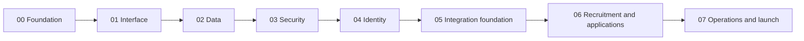

# LOGOS Web Development Roadmap

> - Status: Active — compact delivery plan
> - Project: LOGOS — The Tokyo International School Math Club
> - Architecture authority: [architecture.md](./architecture.md)
> - Compaction record: [roadmap-compaction.md](./roadmap-compaction.md)
> - Current phase: Phase 06 — Recruitment and applications
> - Completed for planning purposes: Phases 00–05
> - Last updated: 2026-09-01

## 1. Purpose and priority

This roadmap delivers a useful, secure LOGOS website in eight total phases. It replaces the former twelve-phase sequence without discarding its important outcomes.

The immediate product priority is the student recruitment journey:

1. a student follows the poster link;
2. the landing page quickly explains why LOGOS is worth joining;
3. the student completes a short, accessible application;
4. Google identity verifies that the applicant controls a TIS account;
5. leadership can read, review, and export the submission without using the database console.

Dashboards and deep Google Workspace automation are secondary. Until they provide real value, they remain minimal structures or ordinary configured links.

## 2. Authority and preserved boundaries

Planning authority remains:

1. `architecture.md` for system-wide security, privacy, provider, and source-of-truth invariants;
2. this roadmap for the compact phase order and launch gates;
3. `phase-##.md` for bounded implementation detail;
4. tests, pull requests, and releases for completion evidence.

References in older documents to former Phases 08–11 map into compact Phase 07. Their phase numbers are superseded; their applicable security and recovery requirements are not silently removed.

The following remain mandatory:

- default-deny server authorization;
- verified Google identity evidence for school affiliation;
- PostgreSQL as the authority for native applications and club workflows;
- no production student data in development or preview;
- no secrets in source, chat, logs, analytics, browser storage, or test fixtures;
- audited protected mutations and durable external-action handling;
- preservation of existing Forms, Sheets, and historical responses;
- proportionate accessibility, recovery, privacy, and security gates before launch;
- explicit approval before destructive actions, live account use, provider configuration, production exposure, or merging.

## 3. Faster execution model

Each remaining phase should use:

1. one short planning checkpoint for genuine product decisions;
2. one or two outcome-owned implementation workstreams;
3. focused checks while working;
4. the established required suite once after relevant changes settle;
5. one focused review;
6. one unmerged pull request and a concise completion report.

Stop when the documented completion gate passes. Do not add repeated audits, speculative abstractions, cosmetic dashboards, redundant browser sessions, or unrelated cleanup.

For browser and provider work:

- delegate browser control to Gemini when it is available and safe;
- otherwise give the user exact, short click-by-click instructions;
- use Codex browser control only when a critical path cannot reasonably be verified another way;
- group provider approvals by exact target and action;
- do not weaken permissions or expose credentials to automate a manual step.

## 4. Development order

## 5. Phase summaries

### Phase 00 — Project and delivery foundation

**Status:** Completed.

Established the reproducible Next.js, TypeScript, pnpm, CI, security automation, repository workflow, and protected-preview foundation.

### Phase 01 — Interface foundation

**Status:** Completed.

Established the approved dark Zinc/Mauve design system, reusable interface primitives, responsive shell, keyboard behavior, and accessibility baseline.

### Phase 02 — Data and environment foundation

**Status:** Completed.

Established Neon PostgreSQL, Drizzle, forward-only migrations, least-privilege roles, isolated environments, synthetic fixtures, and restore verification.

### Phase 03 — Security, audit, and durable operations

**Status:** Completed.

Established request-integrity controls, rate limiting, sanitized telemetry, append-only audit history, correlation identifiers, and durable external-operation records.

### Phase 04 — Identity and authorization

**Status:** Completed and merged.

Established immutable identity association, verified school-affiliation evidence, secure sessions, explicit capabilities, default denial, and prompt local revocation. Live Neon Auth and OAuth activation may remain deferred until provider setup is usable.

### Phase 05 — Compact integration foundation

**Status:** Treated as completed under the approved compact roadmap.

Established or documented the narrow server-side boundaries for Calendar, Drive metadata, Gmail delivery, and configured Classroom links. Live provider activation is not required to reopen this phase. Phase 07 may activate only integrations that offer immediate launch value.

No later phase should expand Phase 05 into broad Workspace automation, Classroom roster synchronization, Drive permission management, or a second backend.

### Phase 06 — Recruitment and applications

**Status:** Next.

**Outcome:** A student arriving from a poster can understand LOGOS, apply without confusion, prove TIS identity, and receive a clear confirmation. Leadership can access the submitted data safely.

**Required scope:**

- a polished, fast, accessible landing page with one dominant application action;
- concise public information needed to establish trust and interest;
- a short application form whose exact wording, choices, required fields, and limits receive one user approval before implementation;
- Google sign-in used only to identify the applicant, verify supported `tokyois.com` evidence, and prevent impersonation or duplicate active submissions;
- no student dashboard requirement and no automatic membership grant;
- PostgreSQL persistence with boundary validation, authorization, audit history, and safe errors;
- a focused leadership-only `/admin/applications` experience with list, detail, basic review status, and CSV export;
- clear success, duplicate, pending-verification, unavailable, and failure states;
- responsive and keyboard-accessible behavior for the critical poster-to-submission journey.

**Application-question baseline:**

- preferred name;
- grade/year;
- mathematical interests or activities;
- short reason for joining;
- short learning or contribution goal;
- optional relevant experience, explicitly stating that experience is not required;
- ability to attend the normal meeting time;
- an accuracy and club-administration acknowledgement.

Do not request addresses, phone numbers, medical details, unnecessary guardian information, long essays, or unbounded sensitive free text.

**Completion gate:** The poster-to-application journey passes with synthetic identities and data; TIS identification and duplicate handling work; submissions and status changes are durable and audited; authorized leadership can review and export applications; unauthorized access denies; the critical journey passes proportionate accessibility, browser, security, and repository checks; and one unmerged PR is ready for approval.

### Phase 07 — Essential operations, polish, and launch

**Status:** Planned.

**Outcome:** LOGOS can operate the small club safely, present a complete public website, and launch without building an elaborate portal.

Phase 07 is one numbered phase with four internal milestones:

#### A. Essential club operations

- deliberately convert accepted applications into active members;
- preserve current and former membership history;
- record club sessions, expected absences, actual attendance, corrections, and basic totals;
- keep expected absence distinct from actual attendance;
- support deliberate manual warning records where required;
- preserve legacy Forms, Sheets, and responses; any migration remains additive, reconciled, reversible, and separately approved.

#### B. Minimal member and leadership structure

- provide only the protected routes and navigation needed for existing capabilities;
- keep the member area barebones until useful content exists;
- present Classroom and Drive as centrally configured approved links by default;
- use lightweight Calendar presentation or links unless API behavior clearly improves the launch experience;
- avoid dashboard widgets, complex analytics, broad reporting, and automatic Classroom membership.

#### C. Public-site completion

- finish About, leadership, schedule/resources, contact, navigation, metadata, and approved content;
- retain the established dark-first Zinc/Mauve direction and restrained motion;
- make recruitment the primary public call to action;
- complete responsive behavior, content polish, and public-route privacy controls.

#### D. Reliability and launch

- prove one practical backup and isolated restore path before real student data is introduced;
- retain sanitized operational logging and audit protections;
- verify production authorization, privacy, environment separation, and credential inventory;
- run one focused accessibility/security review and critical-journey browser pass;
- configure only approved production services and least-privilege integrations;
- obtain explicit launch approval, deploy the accepted release, and record operational handoff.

**Completion gate:** Public, applicant, leadership, and essential member journeys pass; application-to-membership and attendance behavior is authorized and audited; existing historical resources remain preserved; backup and restore evidence passes; required production checks and privacy/security gates pass; the accepted release is explicitly approved and deployed; and the next maintainer can access submissions, operate the club, and recover the system from the documentation.

## 6. Deliberate non-goals for the one-day delivery path

The following do not block launch unless a demonstrated club need makes one essential:

- a rich student dashboard;
- decorative dashboard statistics or widgets;
- Drive file browsing when approved links are sufficient;
- Classroom API access, roster synchronization, or write automation;
- Calendar editing through the website;
- automatic warning decisions;
- enterprise-scale queues, caches, analytics, or observability;
- multiple independent model reviews of the same passing work;
- repeated browser passes after the critical paths pass unchanged.

These are documented deferrals, not permission to weaken authentication, authorization, privacy, auditability, accessibility, or recovery.

## 7. Phase-file structure

New Phase 06 and Phase 07 plans should remain short and contain only:

1. status and objective;
2. dependencies and preserved invariants;
3. scope and non-goals;
4. deliverables;
5. security/privacy/data considerations;
6. a small set of commit checkpoints;
7. focused verification;
8. one completion gate;
9. handoff and completion evidence.

The phase plan should define outcomes and boundaries rather than prescribe every file or trigger a second roadmap-design exercise.

## 8. Roadmap completion

The compact roadmap is complete when Phases 00–07 are accepted, the Phase 07 launch gate passes, the production release is deployed with explicit approval, historical resources remain preserved, and the project can be operated and recovered from its documentation.
